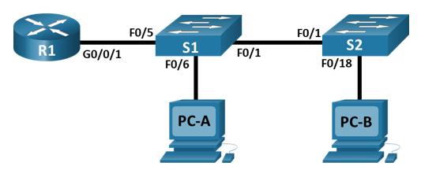
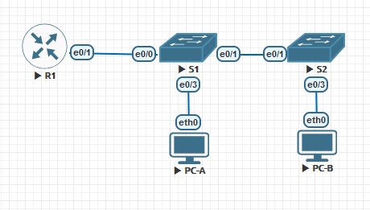

### Внедрение маршрутизации между виртуальными локальными сетями.

## Цель:

- Собрать схему;  
      

- Добавление сетей VLAN и назначение портов;

## Задачи:

- Создание сети и настройка основных параметров устройства
- Создание сетей VLAN и назначение портов коммутатора
- Настройка транка 802.1Q между коммутаторами.
- Настройка маршрутизации между сетями VLAN
- Проверка, что маршрутизация между VLAN работает


## Собираем указанную схему



## Таблица адресов
| Device  | Interface | IP Address   | Subnet Mask   | Default Gateway |
|---------|-----------|--------------|---------------|-----------------|
| R1      | e0/1.3    | 192.168.3.1  | 255.255.255.0 |                 |
|         | e0/1.4    | 192.168.4.1  | 255.255.255.0 |                 |
|         | e0/1.8    |              |               |                 |
| S1      | VLAN3     | 192.168.3.11 | 255.255.255.0 | 192.168.3.1     |
| S2      | VLAN3     | 192.168.3.12 | 255.255.255.0 | 192.168.3.1     |
| PC-A    | eth0      | 192.168.3.3  | 255.255.255.0 | 192.168.3.1     |
| PC-B    | eth0      | 192.168.4.3  | 255.255.255.0 | 192.168.4.1     |
 

## Таблица VLAN
| VLAN |    Name      | Назначенный интерфейс |
|------|--------------|-----------------------|
| 3    | Management   | S1: VLAN3             |
|      |              | S2: VLAN3             |
|      |              | S1: e0/3              |
| 4    | Operations   | S2: e0/3              |
| 7    | ParkingLot   | S1: e0/2              |
|      |              | S2: e0/0, e0/2        |
| 8    | Native       |                       |

### [Файлы конфигураций устройст и сама работа выполненная в EVE-NG ](https://github.com/niknav83/Network-Engineer-Professional/tree/main/labs/lab01/configs)
В данной работе применялись следующие образы:
 - L3-ADVENTERPRISEK9-M-15.4-2T.bin
 - L2-ADVENTERPRISEK9-M-15.2-20150703.bin

# Приступаем к настрйке устройств:

<details>

<summary> Настраиваем базовые параметры для маршрутизатора R1: </summary>

```
en
Router#conf terminal 
Router(config)#hostname R1
R1(config)#no ip domain-lookup 
R1(config)#enable secret class
R1(config)#line console 0
R1(config-line)#password cisco
R1(config-line)#login 
R1(config-line)#exit
R1(config)#line vty 0 4 
R1(config-line)#password cisco
R1(config-line)#login
R1(config-line)#exit
R1(config)#service password-encryption 
R1(config)#banner motd $ Authorized Users Only! $
R1(config)#exit
R1#clock set 14:44:00 21 October 2024
R1#wr
R1#exit
```
</details>


<details>

<summary> Настраиваем базовые параметры для коммутатора S1: </summary>

```
Switch>en
Switch#conf terminal 
Switch(config)#hostname S1
S1(config)#no ip domain-lookup 
S1(config)#enable secret class
S1(config)#line console 0
S1(config-line)#password cisco
S1(config-line)#login 
S1(config-line)#exit
S1(config)#line vty 0 4
S1(config-line)#  password cisco
S1(config-line)#login
S1(config-line)#exit
S1(config)#service password-encryption 
S1(config)#banner motd $ Authorized Users Only! $
S1(config)#do clock set 15:00:00 21 October 20244
S1(config)#exit
S1#wr
S1#exit
```
</details>

<details>

<summary> Настраиваем базовые параметры для коммутатора S2: </summary>

```
Switch>en
Switch#conf terminal 
Switch(config)#hostname S2
S2(config)#no ip domain-lookup 
S2(config)#enable secret class
S2(config)#line console 0
S2(config-line)#password cisco
S2(config-line)#login 
S2(config-line)#exit
S2(config)#line vty 0 4
S2(config-line)#  password cisco
S2(config-line)#login
S2(config-line)#exit
S2(config)#service password-encryption 
S2(config)#banner motd $ Authorized Users Only! $
S2(config)#do clock set 15:00:00 21 October 20244
S2(config)#exit
S2#wr
S2#exit
```
</details>


<details>

<summary> Настраиваем PC-A: </summary>

```
VPCS> ip 192.168.3.3/24 192.168.3.1
Checking for duplicate address...
VPCS : 192.168.3.3 255.255.255.0 gateway 192.168.3.1

VPCS> save
Saving startup configuration to startup.vpc
.  done

VPCS>
```
</details>


<details>

<summary> Настраиваем PC-B: </summary>

```
VPCS> ip 192.168.4.3/24 192.168.4.1
Checking for duplicate address...
VPCS : 192.168.4.3 255.255.255.0 gateway 192.168.4.1

VPCS> save
Saving startup configuration to startup.vpc
.  done

VPCS>
```
</details>

<details>

<summary> Настраиваем VLAN на коммутаторе S1 </summary>

```
S1#conf terminal 
S1(config)#vlan 3
S1(config-vlan)#name Management
S1(config-vlan)#vlan 4
S1(config-vlan)#name Operations
S1(config-vlan)#vlan 7
S1(config-vlan)#name ParkingLot
S1(config-vlan)#vlan 8 
S1(config-vlan)#name Native
S1(config-vlan)#exit
S1(config)#exit
S1#wr
```

```
S1#conf terminal 
S1(config)#interface vlan 3
S1(config-if)#
S1(config-if)#ip address 192.168.3.11 255.255.255.0
S1(config-if)#no shutdown 
S1(config-if)#exit
S1(config)#ip default-gateway 192.168.3.1
S1(config)#exit
S1#wr
```
```
S1#
S1#conf terminal 
S1(config)#interface e0/2
S1(config-if)#switchport mode access 
S1(config-if)#switchport access vlan 7
S1(config-if)#shutdown 
S1(config-if)#exir
S1(config)#exit
S1#wr
```
```
S1>en
S1#conf terminal 
S1(config)#interface e0/3
S1(config-if)#switchport mode access 
S1(config-if)#switchport access vlan 3
S1(config-if)#no shutdown 
S1(config-if)#exit
S1(config)#exit
S1#wr

```

</details>


<details>

<summary> Настраиваем VLAN на коммутаторе S2 </summary>

```
S2#conf terminal 
S2(config)#vlan 3
S2(config-vlan)#name Management
S2(config-vlan)#vlan 4
S2(config-vlan)#name Operations
S2(config-vlan)#vlan 7
S2(config-vlan)#name ParkingLot
S2(config-vlan)#vlan 8 
S2(config-vlan)#name Native
S2(config-vlan)#exit
S2(config)#exit
S2#wr
```

```
S2#conf terminal 
S2(config)#interface vlan 3
S2(config-if)#ip address 192.168.3.12 255.255.255.0
S2(config-if)#no shutdown 
S2(config-if)#exit
S2(config)#ip default-gateway 192.168.3.1
S2(config)#exit
S2#wr
```
```
S2#conf terminal 
S2(config)#interface range e0/0,e0/2
S2(config-if-range)#switchport mode access 
S2(config-if-range)#switchport access vlan 7
S2(config-if-range)#shutdown 
S2(config-if-range)#exit
S2(config)#exit
S2#wr
```
```
S2#conf terminal 
S2(config)#interface e0/3
S2(config-if)#switchport mode access 
S2(config-if)#switchport access vlan 4
S2(config-if)#no shutdown 
S2(config-if)#exit
S2(config)#exit
S2#wr

```

</details>


<details>

<summary> Настраиваем 802.1Q Trunk на коммутаторе S1 </summary>

```
S1#conf terminal 
S1(config)#interface e0/1
S1(config-if)#switchport mode trunk
S1(config-if)#switchport trunk encapsulation dot1q 
S1(config-if)#switchport trunk native vlan 8
S1(config-if)#switchport trunk allowed vlan 3,4,8
S1(config-if)#exit
S1(config)#exit
S1#wr
```
```
S1#conf terminal 
S1(config)#interface e0/0
S1(config-if)#switchport mode trunk 
S1(config-if)#switchport trunk encapsulation dot1q
S1(config-if)#switchport trunk native vlan 8
S1(config-if)#switchport trunk allowed vlan 3,4,8
S1(config-if)#no shutdown 
S1(config-if)#exit
S1(config)#exit
S1#wr
```
</details>


<details>

<summary> Настраиваем 802.1Q Trunk на коммутаторе S2 </summary>

```
S2#conf terminal 
S2(config)#interface e0/1
S2(config-if)#switchport mode trunk
S2(config-if)#switchport trunk encapsulation dot1q 
S2(config-if)#switchport trunk native vlan 8
S2(config-if)#switchport trunk allowed vlan 3,4,8
S2(config-if)#exit
S2(config)#exit
S2#wr
```
</details>


<details>

<summary> Настраиваем маршрутизацию между сетями VLAN </summary>

```
R1#
R1#conf terminal 
R1(config)#interface e0/1
R1(config-if)#no shutdown 
R1(config-if)#exit
R1(config)#
R1(config)#interface e0/1.3
R1(config-subif)#description Management Network
R1(config-subif)#encapsulation dot1Q 3
R1(config-subif)#ip address 192.168.3.1 255.255.255.0
R1(config)#
R1(config)#interface e0/1.4
R1(config-subif)#description Operations Network
R1(config-subif)#encapsulation dot1q 4
R1(config-subif)#ip address 192.168.4.1 255.255.255.0
R1(config-if)#exit
R1(config)#
R1(config)#interface ethernet 0/1.8
R1(config-subif)#description Native VLAN
R1(config-subif)#encapsulation dot1q 8 native
R1(config-subif)#exit
R1(config)#exit
R1#wr

```
</details>


# Приступаем к проверке устройств:

## Проверяем настройки VLAN на коммутаторе S1

<details>

<summary> show vlan </summary>

```
S1#show vlan

VLAN Name                             Status    Ports
---- -------------------------------- --------- -------------------------------
1    default                          active    
3    Management                       active    Et0/3
4    Operations                       active    
7    ParkingLot                       active    Et0/2
8    Native                           active    
1002 fddi-default                     act/unsup 
1003 token-ring-default               act/unsup 
1004 fddinet-default                  act/unsup 
1005 trnet-default                    act/unsup 

VLAN Type  SAID       MTU   Parent RingNo BridgeNo Stp  BrdgMode Trans1 Trans2
---- ----- ---------- ----- ------ ------ -------- ---- -------- ------ ------
1    enet  100001     1500  -      -      -        -    -        0      0   
3    enet  100003     1500  -      -      -        -    -        0      0   
4    enet  100004     1500  -      -      -        -    -        0      0   
7    enet  100007     1500  -      -      -        -    -        0      0   
8    enet  100008     1500  -      -      -        -    -        0      0   
1002 fddi  101002     1500  -      -      -        -    -        0      0   
1003 tr    101003     1500  -      -      -        -    -        0      0   
1004 fdnet 101004     1500  -      -      -        ieee -        0      0   

VLAN Type  SAID       MTU   Parent RingNo BridgeNo Stp  BrdgMode Trans1 Trans2
---- ----- ---------- ----- ------ ------ -------- ---- -------- ------ ------
1005 trnet 101005     1500  -      -      -        ibm  -        0      0   

Primary Secondary Type              Ports
------- --------- ----------------- ------------------------------------------
```
</details>

<details>

<summary> show vlan brief </summary>

```
S1#show vlan brief 

VLAN Name                             Status    Ports
---- -------------------------------- --------- -------------------------------
1    default                          active    
3    Management                       active    Et0/3
4    Operations                       active    
7    ParkingLot                       active    Et0/2
8    Native                           active    
1002 fddi-default                     act/unsup 
1003 token-ring-default               act/unsup 
1004 fddinet-default                  act/unsup 
1005 trnet-default                    act/unsup 
```
</details>

<details>

<summary> show interfaces status </summary>

```
S1#show interfaces status 

Port      Name               Status       Vlan       Duplex  Speed Type 
Et0/0                        connected    trunk        auto   auto unknown
Et0/1                        connected    trunk        auto   auto unknown
Et0/2                        disabled     7            auto   auto unknown
Et0/3                        connected    3            auto   auto unknown
```
</details>


<details>

<summary> show ip interface brief </summary>

```
S1#show ip interface brief 
Interface              IP-Address      OK? Method Status                Protocol
Ethernet0/0            unassigned      YES unset  up                    up      
Ethernet0/1            unassigned      YES unset  up                    up      
Ethernet0/2            unassigned      YES unset  administratively down down    
Ethernet0/3            unassigned      YES unset  up                    up      
Vlan3                  192.168.3.11    YES NVRAM  up                    up      
```
</details>

<details>

<summary> show interfaces trunk </summary>

```
S1#show interfaces trunk 

Port        Mode             Encapsulation  Status        Native vlan
Et0/0       on               802.1q         trunking      8
Et0/1       on               802.1q         trunking      8

Port        Vlans allowed on trunk
Et0/0       3-4,8
Et0/1       3-4,8

Port        Vlans allowed and active in management domain
Et0/0       3-4,8
Et0/1       3-4,8

Port        Vlans in spanning tree forwarding state and not pruned
Et0/0       3-4,8
Et0/1       3-4,8
```
</details>


## Проверяем настройки VLAN на коммутаторе S2


<details>

<summary> show vlan </summary>

```
S2#show vlan

VLAN Name                             Status    Ports
---- -------------------------------- --------- -------------------------------
1    default                          active    
3    Management                       active    
4    Operations                       active    Et0/3
7    ParkingLot                       active    Et0/0, Et0/2
8    Native                           active    
1002 fddi-default                     act/unsup 
1003 token-ring-default               act/unsup 
1004 fddinet-default                  act/unsup 
1005 trnet-default                    act/unsup 

VLAN Type  SAID       MTU   Parent RingNo BridgeNo Stp  BrdgMode Trans1 Trans2
---- ----- ---------- ----- ------ ------ -------- ---- -------- ------ ------
1    enet  100001     1500  -      -      -        -    -        0      0   
3    enet  100003     1500  -      -      -        -    -        0      0   
4    enet  100004     1500  -      -      -        -    -        0      0   
7    enet  100007     1500  -      -      -        -    -        0      0   
8    enet  100008     1500  -      -      -        -    -        0      0   
1002 fddi  101002     1500  -      -      -        -    -        0      0   
1003 tr    101003     1500  -      -      -        -    -        0      0   
1004 fdnet 101004     1500  -      -      -        ieee -        0      0   

Primary Secondary Type              Ports
------- --------- ----------------- ------------------------------------------
```
</details>

<details>

<summary> show vlan brief </summary>

```
S2#show vlan brief

VLAN Name                             Status    Ports
---- -------------------------------- --------- -------------------------------
1    default                          active    
3    Management                       active    
4    Operations                       active    Et0/3
7    ParkingLot                       active    Et0/0, Et0/2
8    Native                           active    
1002 fddi-default                     act/unsup 
1003 token-ring-default               act/unsup 
1004 fddinet-default                  act/unsup 
1005 trnet-default                    act/unsup 
```
</details>

<details>

<summary> show interfaces status </summary>

```
S2#show interfaces status

Port      Name               Status       Vlan       Duplex  Speed Type 
Et0/0                        disabled     7            auto   auto unknown
Et0/1                        connected    trunk        auto   auto unknown
Et0/2                        disabled     7            auto   auto unknown
Et0/3                        connected    4            auto   auto unknown
```
</details>


<details>

<summary> show ip interface brief </summary>

```
S2#show ip interface brief
Interface              IP-Address      OK? Method Status                Protocol
Ethernet0/0            unassigned      YES unset  administratively down down    
Ethernet0/1            unassigned      YES unset  up                    up      
Ethernet0/2            unassigned      YES unset  administratively down down    
Ethernet0/3            unassigned      YES unset  up                    up      
Vlan3                  192.168.3.12    YES manual up                    up      
```
</details>

<details>

<summary> show interfaces trunk </summary>

```
S2#show interfaces trunk 

Port        Mode             Encapsulation  Status        Native vlan
Et0/1       auto             802.1q         trunking      8

Port        Vlans allowed on trunk
Et0/1       3-4,8

Port        Vlans allowed and active in management domain
Et0/1       3-4,8

Port        Vlans in spanning tree forwarding state and not pruned
Et0/1       3-4,8
```
</details>


## Проверяем настройки на маршрутизаторе R1

<details>

<summary> show ip interface brief </summary>

```
R1#show ip interface brief
Interface                  IP-Address      OK? Method Status                Protocol
Ethernet0/0                unassigned      YES NVRAM  administratively down down
Ethernet0/1                unassigned      YES NVRAM  up                    up
Ethernet0/1.3              192.168.3.1     YES NVRAM  up                    up
Ethernet0/1.4              192.168.4.1     YES NVRAM  up                    up
Ethernet0/1.8              unassigned      YES unset  up                    up
Ethernet0/2                unassigned      YES NVRAM  administratively down down
Ethernet0/3                unassigned      YES NVRAM  administratively down down
```
</details>

<details>

<summary> show  ip route </summary>

```
R1#show  ip route
Codes: L - local, C - connected, S - static, R - RIP, M - mobile, B - BGP
       D - EIGRP, EX - EIGRP external, O - OSPF, IA - OSPF inter area
       N1 - OSPF NSSA external type 1, N2 - OSPF NSSA external type 2
       E1 - OSPF external type 1, E2 - OSPF external type 2
       i - IS-IS, su - IS-IS summary, L1 - IS-IS level-1, L2 - IS-IS level-2
       ia - IS-IS inter area, * - candidate default, U - per-user static route
       o - ODR, P - periodic downloaded static route, H - NHRP, l - LISP
       a - application route
       + - replicated route, % - next hop override

Gateway of last resort is not set

      192.168.3.0/24 is variably subnetted, 2 subnets, 2 masks
C        192.168.3.0/24 is directly connected, Ethernet0/1.3
L        192.168.3.1/32 is directly connected, Ethernet0/1.3
      192.168.4.0/24 is variably subnetted, 2 subnets, 2 masks
C        192.168.4.0/24 is directly connected, Ethernet0/1.4
L        192.168.4.1/32 is directly connected, Ethernet0/1.4

```
</details>


## Проверяем работу сети с PC-A

<details>

<summary> Отправьте эхо-запрос с PC-A на шлюз по умолчанию </summary>

```
PC-A> ping 192.168.3.1

84 bytes from 192.168.3.1 icmp_seq=1 ttl=255 time=0.646 ms
84 bytes from 192.168.3.1 icmp_seq=2 ttl=255 time=0.915 ms
84 bytes from 192.168.3.1 icmp_seq=3 ttl=255 time=1.128 ms
84 bytes from 192.168.3.1 icmp_seq=4 ttl=255 time=0.855 ms
84 bytes from 192.168.3.1 icmp_seq=5 ttl=255 time=1.014 ms

PC-A>
```
</details>

<details>

<summary> Отправьте эхо-запрос с PC-A на PC-B </summary>

```
PC-A> ping 192.168.4.3

84 bytes from 192.168.4.3 icmp_seq=1 ttl=63 time=2.659 ms
84 bytes from 192.168.4.3 icmp_seq=2 ttl=63 time=1.383 ms
84 bytes from 192.168.4.3 icmp_seq=3 ttl=63 time=2.097 ms
84 bytes from 192.168.4.3 icmp_seq=4 ttl=63 time=1.906 ms
84 bytes from 192.168.4.3 icmp_seq=5 ttl=63 time=1.809 ms

PC-A>
```
</details>

<details>

<summary> Отправьте команду ping с компьютера PC-A на коммутатор S2 </summary>

```
PC-A> ping 192.168.3.12

84 bytes from 192.168.3.12 icmp_seq=1 ttl=255 time=0.875 ms
84 bytes from 192.168.3.12 icmp_seq=2 ttl=255 time=0.884 ms
84 bytes from 192.168.3.12 icmp_seq=3 ttl=255 time=0.965 ms
84 bytes from 192.168.3.12 icmp_seq=4 ttl=255 time=1.110 ms
84 bytes from 192.168.3.12 icmp_seq=5 ttl=255 time=1.081 ms

PC-A>

```
</details>


## Проверяем работу сети с PC-B

<details>

<summary> В окне командной строки на PC-B выполните команду tracert на адрес PC-A </summary>

```
PC-B> tracer 192.168.3.3
trace to 192.168.3.3, 8 hops max, press Ctrl+C to stop
 1   192.168.4.1   1.364 ms  0.910 ms  0.534 ms
 2   *192.168.3.3   1.102 ms (ICMP type:3, code:3, Destination port unreachable)

PC-B>

```
</details>
