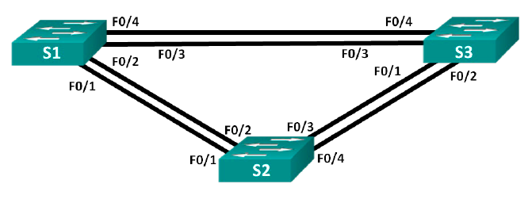
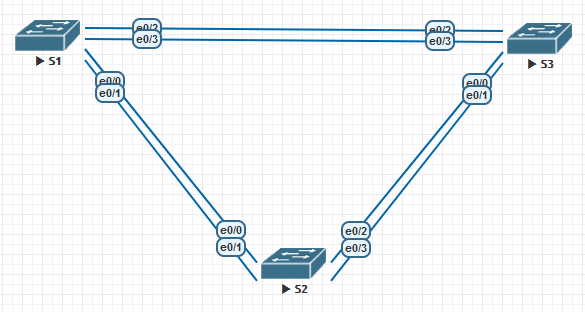

### Развертывание коммутируемой сети с резервными каналами

## Цель:

- Собрать схему;  
      

 - Создание сети и настройка основных параметров устройства 
 - Выбор корневого моста
 - Наблюдение за процессом выбора протоколом STP порта, исходя из стоимости портов
 - Наблюдение за процессом выбора протоколом STP порта, исходя из приоритета портов

## Собираем указанную схему

## Таблица адресов
| Device  | Interface | IP Address   | Subnet Mask   |
|---------|-----------|--------------|---------------|
| S1      | VLAN1     | 192.168.3.1 | 255.255.255.0 |
| S2      | VLAN1     | 192.168.3.2 | 255.255.255.0 |
| S3      | VLAN1     | 192.168.3.2 | 255.255.255.0 |
 

### [Файлы конфигураций устройст и сама работа выполненная в EVE-NG ](https://gl.niknav.ru/otus/network_engineer_professional/-/tree/main/labs/lab02/configs)
В данной работе применялись следующие образы:
 - L3-ADVENTERPRISEK9-M-15.4-2T.bin
 - L2-ADVENTERPRISEK9-M-15.2-20150703.bin
