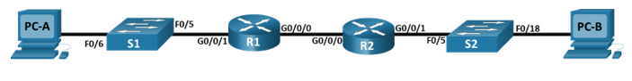
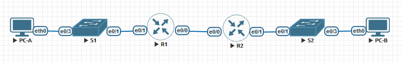

### Настроить DHCPv4.

## Цель:

- Собрать схему;  
      

- Настроить DHCPv4;

## Задачи:

- Построение сети и настройка основных параметров устройства
- Настройка и проверка двух серверов DHCPv4 на R1
- Настройка и проверка DHCP-ретранслятора на R2


## Собираем указанную схему



## Таблица адресов
| Device  | Interface | IP Address   | Subnet Mask     | Default Gateway |
|---------|-----------|--------------|-----------------|-----------------|
| R1      | e0/0      | 10.0.0.1     | 255.255.255.252 |                 |
|         | e0/1      |              |                 |                 |
|         | e0/1.100  |              |                 |                 |
|         | e0/1.200  |              |                 |                 |
|         | e0/1.1000 |              |                 |                 |
| R2      | e0/0      | 10.0.0.2     | 255.255.255.252 |                 |
|         | e0/1      |              |                 |                 |
| S1      | VLAN 200  |              |                 |                 |
| S2      | VLAN 1    |              |                 |                 |
| PC-A    |           | DHCP         | DHCP            | DHCP            |
| PC-B    |           | DHCP         | DHCP            | DHCP            |
 

## Таблица VLAN
| VLAN |    Name      | Назначенный интерфейс |
|------|--------------|-----------------------|
| 1    |              | S2 e0/3               |
| 100  | Clients      | S1 e0/3               |
| 200  | Management   | S1 VLAN 200           |
| 999  | Parking_Lot  | S1 e0/0,e0/2          |
| 1000 | Native       |                       |


### [Файлы конфигураций устройст и сама работа выполненная в EVE-NG ](https://github.com/niknav83/Network-Engineer-Professional/tree/main/labs/lab03.1/configs)
В данной работе применялись следующие образы:
 - L3-ADVENTERPRISEK9-M-15.4-2T.bin
 - L2-ADVENTERPRISEK9-M-15.2-20150703.bin

# Приступаем к настрйке устройств:

<details>

<summary> Настраиваем базовые параметры для маршрутизатора R1: </summary>

```

```
</details>

<details>

<summary> Настраиваем базовые параметры для маршрутизатора R2: </summary>

```

```
</details>


<details>

<summary> Настраиваем базовые параметры для коммутатора S1: </summary>

```

```
</details>

<details>

<summary> Настраиваем базовые параметры для коммутатора S2: </summary>

```

```
</details>


<details>

<summary> Настраиваем PC-A: </summary>

```

```
</details>


<details>

<summary> Настраиваем PC-B: </summary>

```

```
</details>

<details>

<summary> Настраиваем VLAN на коммутаторе S1 </summary>

```

```

```

```
```

```
```


```

</details>


<details>

<summary> Настраиваем VLAN на коммутаторе S2 </summary>

```

```

```

```
```

```
```


```

</details>


# Приступаем к проверке устройств:

