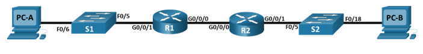
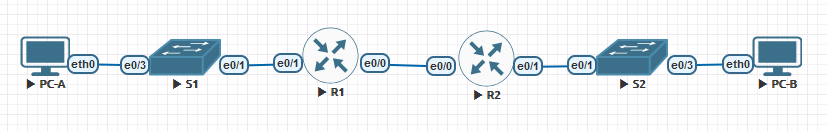
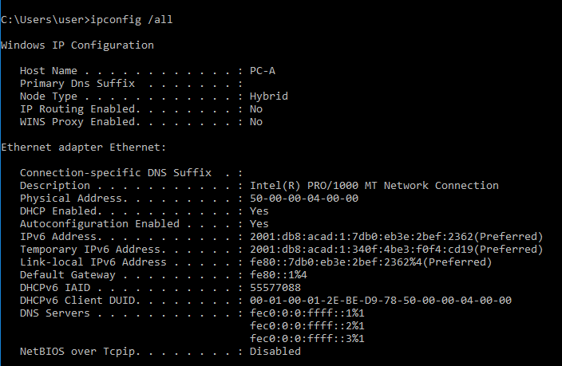
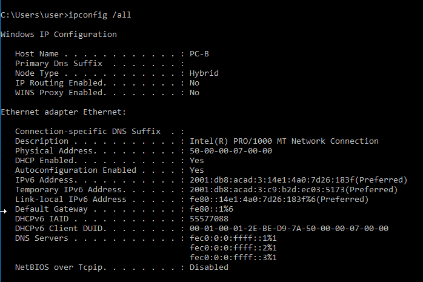
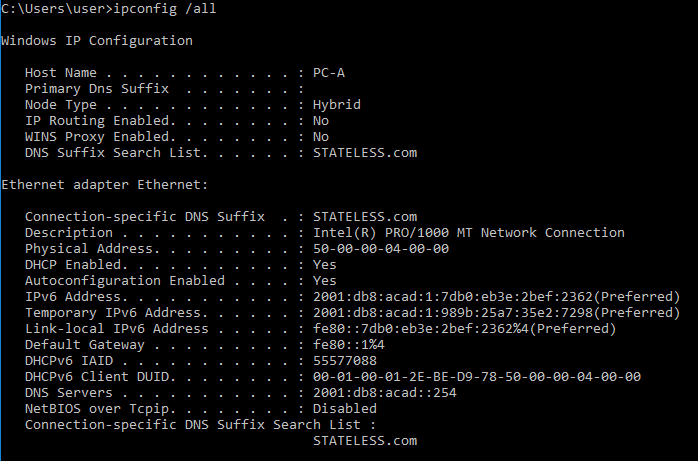
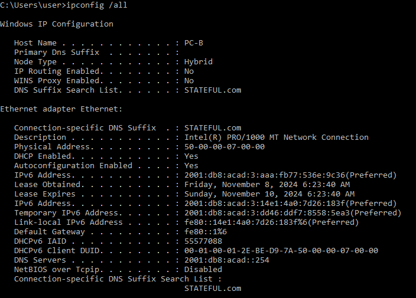

### Настроить DHCPv6.

## Цель:

- Собрать схему;  
      

- Настроить DHCPv6;

## Задачи:

 - Построение сети и настройка основных параметров устройства
 - Проверка назначения адреса SLAAC из R1
 - Настройка и проверка сервера DHCPv6 без состояния на R1
 - Настройка и проверка сервера DHCPv6 с отслеживанием состояния на R1
 - Настройка и проверка реле DHCPv6 на R2


## Собираем указанную схему



## Таблица адресов
| Device  | Interface | IP Address Subnet Mask | Default Gateway |
|---------|-----------|------------------------|-----------------|
| R1      | e0/0      | 2001:db8:acad:2::1 /64 |                 | 
|         |           | fe80::1                |                 | 
|         | e0/1      | 2001:db8:acad:1::1/64  |                 | 
|         |           | fe80::1                |                 | 
| R2      | e0/0      | 2001:db8:acad:2::2/64  |                 | 
|         |           | fe80::2                |                 | 
|         | e0/1      | 2001:db8:acad:3::1 /64 |                 | 
|         |           | fe80::1                |                 | 
| PC-A    |           | DHCP                   |                 | 
| PC-B    |           | DHCP                   |                 | 

 
### [Файлы конфигураций устройст и сама работа выполненная в EVE-NG ](https://github.com/niknav83/Network-Engineer-Professional/tree/main/labs/lab03.2/configs)

В данной работе применялись следующие образы:
 - L3-ADVENTERPRISEK9-M-15.4-2T.bin
 - L2-ADVENTERPRISEK9-M-15.2-20150703.bin

# Приступаем к настрйке устройств:

<details>

<summary> Настраиваем базовые параметры для маршрутизатора R1: </summary>

```
Router#conf terminal 
Router(config)#hostname R1
R1(config)#no ip domain lookup 
R1(config)#enable secret class
R1(config)#line console 0
R1(config-line)#password cisco 
R1(config-line)#login
R1(config-line)#exit
R1(config)#line vty 0 4 
R1(config-line)#password cisco
R1(config-line)#login
R1(config-line)#exit
R1(config)#service password-encryption 
R1(config)#banner motd $ Authorized Users Only! $
R1(config)#exit
R1#clock set 10:22:00 06 Nov 2024
R1#wr
```
</details>

<details>

<summary> Настраиваем базовые параметры для маршрутизатора R2: </summary>

```
Router#conf terminal 
Router(config)#hostname R2
R2(config)#no ip domain lookup 
R2(config)#enable secret class
R2(config)#line console 0
R2(config-line)#password cisco 
R2(config-line)#login
R2(config-line)#exit
R2(config)#line vty 0 4 
R2(config-line)#password cisco
R2(config-line)#login
R2(config-line)#exit
R2(config)#service password-encryption 
R2(config)#banner motd $ Authorized Users Only! $
R2(config)#exit
R2#clock set 10:22:00 06 Nov 2024
R2#wr
```
</details>


<details>

<summary> Настраиваем базовые параметры для коммутатора S1: </summary>

```
Switch#conf terminal 
Switch(config)#hostname S1
S1(config)#no ip domain-lookup
S1(config)# enable secret class
S1(config)#line console 0
S1(config-line)#password cisco
S1(config-line)#login
S1(config-line)#exit
S1(config)# line vty 0 4
S1(config-line)#password cisco
S1(config-line)#login
S1(config-line)#exit
S1(config)#service password-encryption
S1(config)#banner motd $ Authorized Users Only! $
S1(config)#interface range ethernet 0/0, ethernet 0/2
S1(config-if-range)#shutdown
S1(config)#exit
S1#clock set 10:22:00 06 Nov 2024
S1#wr

```
</details>

<details>

<summary> Настраиваем базовые параметры для коммутатора S2: </summary>

```
Switch#conf terminal 
Switch(config)#hostname S2
S2(config)#no ip domain-lookup
S2(config)# enable secret class
S2(config)#line console 0
S2(config-line)#password cisco
S2(config-line)#login
S2(config-line)#exit
S2(config)# line vty 0 4
S2(config-line)#password cisco
S2(config-line)#login
S2(config-line)#exit
S2(config)#service password-encryption
S2(config)#banner motd $ Authorized Users Only! $
S2(config)#interface range ethernet 0/0, ethernet 0/2
S2(config-if-range)#shutdown
S2(config)#exit
S2#clock set 10:22:00 06 Nov 2024
S2#wr
```
</details>


<details>

<summary> Настраиваем интерфейсы и маршрутизацию для R1 </summary>

```
R1#conf terminal
R1(config)#ipv6 unicast-routing
R1(config)# interface e0/1
R1(config-if)# ipv6 address fe80::1 link-local
R1(config-if)# ipv6 address 2001:db8:acad:1::1/64
R1(config-if)# no shutdown
R1(config)# interface e0/0
R1(config-if)# ipv6 address fe80::1 link-local
R1(config-if)# ipv6 address 2001:db8:acad:2::1/64
R1(config-if)# no shutdown
R1(config-if)#exit
R1(config)#ipv6 route ::/0 2001:db8:acad:2::2
R1(config)#exit
R1#wr
```
</details>


<details>

<summary> Настраиваем интерфейсы и маршрутизацию для R2 </summary>

```
R2#conf terminal
R2(config)#ipv6 unicast-routing
R2(config)# interface e0/1
R2(config-if)# ipv6 address fe80::1 link-local
R2(config-if)# ipv6 address 2001:db8:acad:3::1/64
R2(config-if)# no shutdown
R2(config)# interface e0/0
R2(config-if)# ipv6 address fe80::2 link-local
R2(config-if)# ipv6 address 2001:db8:acad:2::2/64
R2(config-if)# no shutdown
R2(config-if)#exit
R2(config)#ipv6 route ::/0 2001:db8:acad:2::1
R2(config)#exit
R2#wr
```
</details>


<details>

<summary> Проверка назначения адреса SLAAC для PC-A: </summary>



</details>


<details>

<summary> Проверка назначения адреса SLAAC для PC-B: </summary>



</details>


<details>

<summary> Настраиваем R1 для предоставления DHCPv6 без сохранения состояния для PC-A </summary>

```
R1#conf terminal
R1(config)#ipv6 dhcp pool R1-STATELESS
R1(config-dhcpv6)#dns-server 2001:db8:acad::254
R1(config-dhcpv6)#domain-name STATELESS.com
R1(config-dhcpv6)#exit
R1(config)#interface e0/1
R1(config-if)#ipv6 nd other-config-flag
R1(config-if)#ipv6 dhcp server R1-STATELESS
R1(config-if)#exit
R1(config)#exit
R1#wr

```
</details>


<details>

<summary> Проверка назначения адреса DHCPv6 для PC-A: </summary>



</details>


<details>

<summary> Настраиваем DHCPv6-сервер с отслеживанием состояния на R1 </summary>

```
R1#conf terminal
R1(config)#ipv6 dhcp pool R2-STATEFUL
R1(config-dhcpv6)#address prefix 2001:db8:acad:3:aaa::/80
R1(config-dhcpv6)#dns-server 2001:db8:acad::254
R1(config-dhcpv6)#domain-name STATEFUL.com
R1(config-dhcpv6)#exit
R1(config)#interface e0/0
R1(config-if)#ipv6 dhcp server R2-STATEFUL
R1(config-if)#exit
R1(config)#exit
R1#wr
```
</details>


<details>

<summary> Проверка назначения адреса SLAAC для PC-B: </summary>


</details>

<details>

<summary> Настраиваем DHCPv6 relay на R2 </summary>

```
R2#conf terminal
R2(config)#interface ethernet 0/1
R2(config-if)#ipv6 nd managed-config-flag
R2(config-if)#ipv6 dhcp relay destination 2001:db8:acad:2::1 ethernet 0/0
R2(config-if)#exit
R2(config)#exit
R2#wr
```
</details>

<details>

<summary> Проверка назначения адреса DHCPv6 для PC-B: </summary>



</details>
