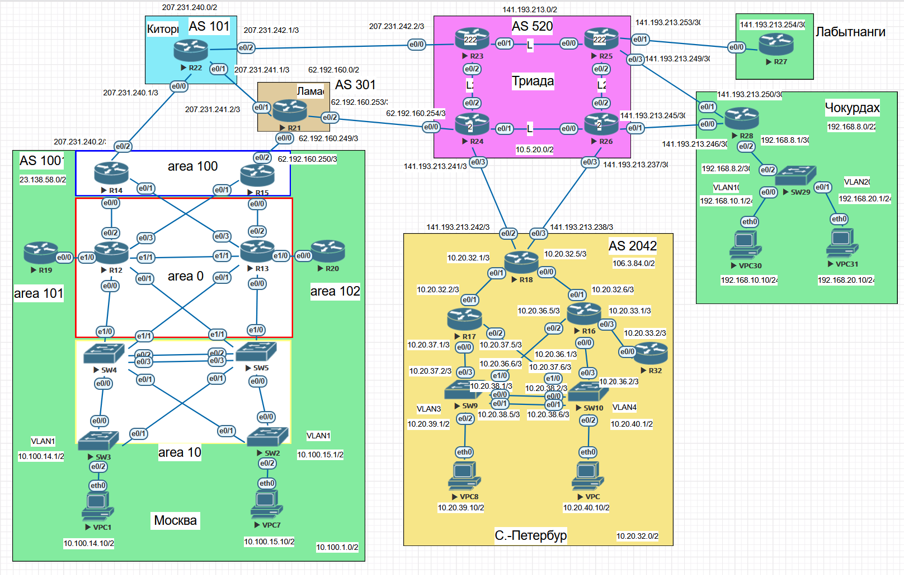

### Проектирование сети.

## Цель:

- Собрать схему;  
      

- В данной самостоятельной работе необходимо распланировать адресное пространство
- Настроить IP на всех активных портах для дальнейшей работы над проектом
- Адресное пространство должно быть задокументировано

## Задачи:

- Разработаете и задокументируете адресное пространство для лабораторного стенда.
- Настроите ip адреса на каждом активном порту
- Настроите каждый VPC в каждом офисе в своем VLAN.
- Настроите VLAN/Loopbackup interface управления для сетевых устройств
- Настроите сети офисов так, чтобы не возникало broadcast штормов, а использование линков было максимально оптимизировано
- Используете IPv4. IPv6 по желанию


## Таблица адресов для AS 101 (Киторн)
| Device  | Interface | IP Address     | Subnet Mask     | Default Gateway |
|---------|-----------|----------------|-----------------|-----------------|
| R22     | lo0       | 207.231.240.22 | 255.255.255.252 |                 |
|         | e0/0      | 207.231.240.1  | 255.255.255.252 |                 | 
|         | e0/1      | 207.231.241.1  | 255.255.255.252 |                 | 
|         | e0/2      | 207.231.242.1  | 255.255.255.252 |                 | 


## Таблица адресов для AS 301 (Ламас)
| Device  | Interface | IP Address     | Subnet Mask     | Default Gateway |
|---------|-----------|----------------|-----------------|-----------------|
| R21     | lo0       | 62.192.160.21  | 255.255.255.252 |                 |
|         | e0/0      | 62.192.160.249 | 255.255.255.252 |                 |
|         | e0/1      | 207.231.241.2  | 255.255.255.252 |                 |
|         | e0/2      | 62.192.160.253 | 255.255.255.252 |                 |

## Таблица адресов для AS 520 (Триада)
| Device  | Interface | IP Address      | Subnet Mask     | Default Gateway |
|---------|-----------|-----------------|-----------------|-----------------|
| R23     | lo0       | 10.5.20.23      | 255.255.255.255 |                 |
|         | e0/0      | 207.231.242.2   | 255.255.255.252 |                 |
|         | e0/1      | 10.5.20.1       | 255.255.255.252 |                 |
|         | e0/2      | 10.5.20.5       | 255.255.255.252 |                 |
| R24     | lo0       | 10.5.20.24      | 255.255.255.255 |                 |
|         | e0/0      | 62.192.160.254  | 255.255.255.252 |                 |
|         | e0/1      | 10.5.20.13      | 255.255.255.252 |                 |
|         | e0/2      | 10.5.20.6       | 255.255.255.252 |                 |
|         | e0/3      | 141.193.213.241 | 255.255.255.252 |                 |
| R25     | lo0       | 10.5.20.25      | 255.255.255.255 |                 |
|         | e0/0      | 10.5.20.2       | 255.255.255.252 |                 | 
|         | e0/1      | 141.193.213.253 | 255.255.255.252 |                 |
|         | e0/2      | 10.5.20.9       | 255.255.255.252 |                 |
|         | e0/3      | 141.193.213.249 | 255.255.255.252 |                 |
| R26     | lo0       | 10.5.20.26      | 255.255.255.255 |                 |
|         | e0/0      | 10.5.20.14      | 255.255.255.252 |                 |
|         | e0/1      | 141.193.213.245 | 255.255.255.252 |                 |
|         | e0/2      | 10.5.20.10      | 255.255.255.252 |                 |
|         | e0/3      | 141.193.213.237 | 255.255.255.252 |                 |

## Таблица адресов для Лабытнанги
| Device  | Interface | IP Address      | Subnet Mask     | Default Gateway |
|---------|-----------|-----------------|-----------------|-----------------|
| R27     | e0/0      | 141.193.213.254 | 255.255.255.252 | 141.193.213.253 |


## Таблица адресов AS 1001 (Москва)
| Device  | Interface | IP Address     | Subnet Mask     | Default Gateway |
|---------|-----------|----------------|-----------------|-----------------|
| R14     | lo0       | 10.100.0.14    | 255.255.255.255 |                 |
|         | e0/0      | 10.100.1.10    | 255.255.255.252 |                 |
|         | e0/1      | 10.100.1.38    | 255.255.255.252 |                 |
|         | e0/2      | 207.231.240.2  | 255.255.255.252 |                 |
| R15     | lo0       | 10.100.0.15    | 255.255.255.255 |                 |
|         | e0/0      | 10.100.1.34    | 255.255.255.252 |                 |
|         | e0/1      | 10.100.1.14    | 255.255.255.252 |                 |
|         | e0/2      | 62.192.160.250 | 255.255.255.252 |                 |
| R12     | lo0       | 10.100.0.12    | 255.255.255.255 |                 |
|         | e0/0      | 10.100.1.1     | 255.255.255.252 |                 |
|         | e0/1      | 10.100.1.5     | 255.255.255.252 |                 |
|         | e0/2      | 10.100.1.9     | 255.255.255.252 |                 |
|         | e0/3      | 10.100.1.13    | 255.255.255.252 |                 |
|         | e1/0      | 10.100.1.17    | 255.255.255.252 |                 |
|         | e1/1      | 10.100.1.21    | 255.255.255.252 |                 |
| R13     | lo0       | 10.100.0.13    | 255.255.255.255 |                 |
|         | e0/0      | 10.100.1.25    | 255.255.255.252 |                 |
|         | e0/1      | 10.100.1.29    | 255.255.255.252 |                 |
|         | e0/2      | 10.100.1.33    | 255.255.255.252 |                 |
|         | e0/3      | 10.100.1.37    | 255.255.255.252 |                 |
|         | e1/0      | 10.100.1.41    | 255.255.255.252 |                 |
|         | e1/1      | 10.100.1.22    | 255.255.255.252 |                 |
| R19     | lo0       | 10.100.0.19    | 255.255.255.255 |                 |
|         | e0/0      | 10.100.1.18    | 255.255.255.252 |                 |
| R20     | lo0       | 10.100.0.20    | 255.255.255.255 |                 |
|         | e0/0      | 10.100.1.42    | 255.255.255.252 |                 |
| SW2     | lo0       | 10.100.0.2     | 255.255.255.255 |                 |
|         | e0/0      | 10.100.10.18   | 255.255.255.252 |                 |
|         | e0/1      | 10.100.10.21   | 255.255.255.252 |                 |
| SW3     | lo0        | 10.100.0.3     | 255.255.255.255 |                 |
|         | e0/0      | 10.100.10.2    | 255.255.255.252 |                 | 
|         | e0/1      | 10.100.10.22   | 255.255.255.252 |                 |
| SW4     | lo0       | 10.100.0.4     | 255.255.255.255 |                 |
|         | e0/0      | 10.100.10.1    | 255.255.255.252 |                 |
|         | e0/1      | 10.100.10.5    | 255.255.255.252 |                 |
|         | e0/2      | 10.100.10.9    | 255.255.255.252 |                 |
|         | e0/3      | 10.100.10.13   | 255.255.255.252 |                 |
|         | e1/0      | 10.100.1.2     | 255.255.255.252 |                 |
|         | e1/1      | 10.100.1.30    | 255.255.255.252 |                 |
| SW5     | lo0       | 10.100.0.5     | 255.255.255.255 |                 | 
|         | e0/0      | 10.100.10.17   | 255.255.255.252 |                 |
|         | e0/1      | 10.100.10.21   | 255.255.255.252 |                 |
|         | e0/2      | 10.100.10.10   | 255.255.255.252 |                 |
|         | e0/3      | 10.100.10.14   | 255.255.255.252 |                 |
|         | e1/0      | 10.100.1.26    | 255.255.255.252 |                 |
|         | e1/1      | 10.100.1.6     | 255.255.255.252 |                 |
| VPC1    | eth0      | 10.100.14.10   | 255.255.255.0   |                 |
| VPC7    | eth0      | 10.100.15.10   | 255.255.255.0   |                 |

## Таблица VLAN для AS 1001 (Москва)
| VLAN  |    Name      | Назначенный интерфейс         |
|-------|--------------|-------------------------------|
| 14    | Native       | SW3: e0/2                     |
| 15    | Native       | SW4: e0/2                     |
| 999   | ParkingLot   | SW3,SW4: Et0/3,Et1/0-3        |


## Таблица адресов AS 2042 (С.-Петербург)
| Device  | Interface | IP Address      | Subnet Mask     | Default Gateway |
|---------|-----------|-----------------|-----------------|-----------------|
| R16     | lo0       | 10.20.42.16     | 255.255.255.255 |                 |
|         | e0/0      | 10.20.36.1      | 255.255.255.252 |                 |
|         | e0/1      | 10.20.32.6      | 255.255.255.252 |                 |
|         | e0/2      | 10.20.36.5      | 255.255.255.252 |                 |
|         | e0/3      | 10.20.33.1      | 255.255.255.252 |                 |
| R17     | lo0       | 10.20.42.17     | 255.255.255.255 |                 |
|         | e0/0      | 10.20.37.1      | 255.255.255.252 |                 |
|         | e0/1      | 10.20.32.2      | 255.255.255.252 |                 |
|         | e0/2      | 10.20.37.5      | 255.255.255.252 |                 |
| R18     | lo0       | 10.20.42.18     | 255.255.255.255 |                 |
|         | e0/0      | 10.20.32.5      | 255.255.255.252 |                 |
|         | e0/1      | 10.20.32.1      | 255.255.255.252 |                 |
|         | e0/2      | 141.193.213.242 | 255.255.255.252 |                 |
|         | e0/3      | 141.193.213.238 | 255.255.255.252 |                 |
| R32     | lo0       | 10.20.42.32     | 255.255.255.255 |                 |
|         | e0/0      | 10.20.33.2      | 255.255.255.252 |                 |
| SW9     | lo0       | 10.20.42.9      | 255.255.255.255 |                 |
|         | e0/0      | 10.20.38.1      | 255.255.255.252 |                 |
|         | e0/1      | 10.20.38.5      | 255.255.255.252 |                 |
|         | vlan39    | 10.20.39.1      | 255.255.255.0   |                 |
|         | e0/3      | 10.20.37.2      | 255.255.255.252 |                 |
|         | e1/0      | 10.20.36.6      | 255.255.255.252 |                 |
| SW10    | lo0       | 10.20.42.10     | 255.255.255.255 |                 |
|         | e0/0      | 10.20.38.2      | 255.255.255.252 |                 |
|         | e0/1      | 10.20.38.6      | 255.255.255.252 |                 |
|         | vlan40    | 10.20.40.1      | 255.255.255.0   |                 |
|         | e0/3      | 10.20.36.2      | 255.255.255.252 |                 |
|         | e1/0      | 10.20.37.6      | 255.255.255.252 |                 |
| VPC8    | eth0      | 10.20.39.10     | 255.255.255.0   | 10.20.39.1      |
| VPC     | eth0      | 10.20.40.10     | 255.255.255.0   | 10.20.40.1      | 
 
## Таблица VLAN для AS 2042 (С.-Петербург)
| VLAN  |    Name      | Назначенный интерфейс    |
|-------|--------------|--------------------------|
| 39    | Native       | SW9:  e0/2               |
| 40    | Native       | SW10: e0/2               |
| 999   | ParkingLot   | SW9,SW10: e1/1,e1/2,e1/3 |

## Таблица адресов Чокурдан
| Device  | Interface | IP Address      | Subnet Mask     | Default Gateway |
|---------|-----------|-----------------|-----------------|-----------------|
| R28     | lo0       | 192.168.8.28    | 255.255.255.255 |                 |
|         | e0/0      | 141.193.213.246 | 255.255.255.252 | 141.193.213.245 |
|         | e0/1      | 141.193.213.250 | 255.255.255.252 | 141.193.213.249 |
|         | e0/2      | 192.168.8.1     | 255.255.255.252 |                 |
| SW29    | lo0       | 192.168.8.29    | 255.255.255.255 |                 |
|         | e0/0      | 192.168.10.1    | 255.255.255.0   |                 | 
|         | e0/1      | 192.168.20.1    | 255.255.255.0   |                 | 
|         | e0/2      | 192.168.8.2     | 255.255.255.252 | 192.168.8.1     |
| VPC30   | eth0      | 192.168.10.10   | 255.255.255.0   | 192.168.10.1    |
| VPC31   | eht0      | 192.168.20.10   | 255.255.255.0   | 192.168.20.1    |

 
## Таблица VLAN для Чокурдан
| VLAN  |    Name      | Назначенный интерфейс           |
|-------|--------------|---------------------------------|
| 10    | Native       | SW29:  e0/0                     |
| 20    | Native       | SW29:  e0/1                     |
| 999   | ParkingLot   | SW29:  e0/3,e1/0,e1/1,e1/2,e1/3 |


### [Файлы конфигураций устройст и сама работа выполненная в EVE-NG ](https://github.com/niknav83/Network-Engineer-Professional/tree/main/labs/lab04/configs)
В данной работе применялись следующие образы:
 - L3-ADVENTERPRISEK9-M-15.4-2T.bin
 - L2-ADVENTERPRISEK9-M-15.2-20150703.bin

# Приступаем к настрйке устройств:

## Настраиваем базовые параметры

<details>

<summary> Настраиваем базовые параметры для маршрутизатора R12: </summary>

```
en
Router#conf terminal 
Router(config)#hostname R12
R12(config)#no ip domain-lookup 
R12(config)#enable secret class
R12(config)#line console 0
R12(config-line)#password cisco
R12(config-line)#login 
R12(config-line)#exit
R12(config)#line vty 0 4 
R12(config-line)#password cisco
R12(config-line)#login
R12(config-line)#exit
R12(config)#service password-encryption 
R12(config)#banner motd $ Authorized Users Only! $
R12(config)#exit
R12#wr
R12#exit
```
</details>


<details>

<summary> Настраиваем базовые параметры для коммутатора S2: </summary>

```
Switch>en
Switch#conf terminal 
Switch(config)#hostname S2
S2(config)#no ip domain-lookup 
S2(config)#enable secret class
S2(config)#line console 0
S2(config-line)#password cisco
S2(config-line)#login 
S2(config-line)#exit
S2(config)#line vty 0 4
S2(config-line)#  password cisco
S2(config-line)#login
S2(config-line)#exit
S2(config)#service password-encryption 
S2(config)#banner motd $ Authorized Users Only! $
S2(config)#exit
S2#wr
S2#exit
```
</details>

### Все остальные устройства настраиваем по аналогии.


## Настраиваем интерфейсы и ip адреса

# AS 101 (Киторн)

<details>

<summary> Настраиваем интерфейсы для маршрутизатора R22: </summary>

```
interface Loopback0
 no shutdown
 ip address 207.231.240.22 255.255.255.252
!
interface Ethernet0/0
 no shutdown
 ip address 207.231.240.1 255.255.255.252
!
interface Ethernet0/1
 no shutdown
 ip address 207.231.241.1 255.255.255.252
!
interface Ethernet0/2
 no shutdown
 ip address 207.231.242.1 255.255.255.252
!
interface Ethernet0/3
 no shutdown
 no ip address
 shutdown
!
interface Ethernet1/0
 no shutdown
 no ip address
 shutdown
!
interface Ethernet1/1
 no shutdown
 no ip address
 shutdown
!
interface Ethernet1/2
 no shutdown
 no ip address
 shutdown
!
interface Ethernet1/3
 no shutdown
 no ip address
 shutdown
```
</details>


# AS 301 (Ламас)

<details>

<summary> Настраиваем интерфейсы для маршрутизатора R21: </summary>

```
interface Loopback0
 no shutdown
 ip address 62.192.160.21 255.255.255.252
!
interface Ethernet0/0
 no shutdown
 ip address 62.192.160.249 255.255.255.252
!
interface Ethernet0/1
 no shutdown
 ip address 207.231.241.2 255.255.255.252
!
interface Ethernet0/2
 no shutdown
 ip address 62.192.160.253 255.255.255.252
!
interface Ethernet0/3
 no shutdown
 no ip address
 shutdown
!
interface Ethernet1/0
 no shutdown
 no ip address
 shutdown
!
interface Ethernet1/1
 no shutdown
 no ip address
 shutdown
!
interface Ethernet1/2
 no shutdown
 no ip address
 shutdown
!
interface Ethernet1/3
 no shutdown
 no ip address
 shutdown
```
</details>


# AS 520 (Триада)

<details>

<summary> Настраиваем интерфейсы для маршрутизатора R23: </summary>

```
nterface Loopback0
 no shutdown
 ip address 10.5.20.23 255.255.255.255
!
interface Ethernet0/0
 no shutdown
 ip address 207.231.242.2 255.255.255.252
!
interface Ethernet0/1
 no shutdown
 ip address 10.5.20.1 255.255.255.252
!
interface Ethernet0/2
 no shutdown
 ip address 10.5.20.5 255.255.255.252
!
interface Ethernet0/3
 no shutdown
 no ip address
 shutdown
!
interface Ethernet1/0
 no shutdown
 no ip address
 shutdown
!
interface Ethernet1/1
 no shutdown
 no ip address
 shutdown
!
interface Ethernet1/2
 no shutdown
 no ip address
 shutdown
!
interface Ethernet1/3
 no shutdown
 no ip address
 shutdown
```
</details>

<details>

<summary> Настраиваем интерфейсы для маршрутизатора R24: </summary>

```
interface Loopback0
 no shutdown
 ip address 10.5.20.24 255.255.255.255
!
interface Ethernet0/0
 no shutdown
 ip address 62.192.160.254 255.255.255.252
!
interface Ethernet0/1
 no shutdown
 ip address 10.5.20.13 255.255.255.252
!
interface Ethernet0/2
 no shutdown
 ip address 10.5.20.6 255.255.255.252
!
interface Ethernet0/3
 no shutdown
 ip address 141.193.213.241 255.255.255.252
!
interface Ethernet1/0
 no shutdown
 no ip address
 shutdown
!
interface Ethernet1/1
 no shutdown
 no ip address
 shutdown
!
interface Ethernet1/2
 no shutdown
 no ip address
 shutdown
!
interface Ethernet1/3
 no shutdown
 no ip address
 shutdown
```
</details>


<details>

<summary> Настраиваем интерфейсы для маршрутизатора R25: </summary>

```
interface Loopback0
 no shutdown
 ip address 10.5.20.25 255.255.255.255
!
interface Ethernet0/0
 no shutdown
 ip address 10.5.20.2 255.255.255.252
!
interface Ethernet0/1
 no shutdown
 ip address 141.193.213.253 255.255.255.252
!
interface Ethernet0/2
 no shutdown
 ip address 10.5.20.9 255.255.255.252
!
interface Ethernet0/3
 no shutdown
 ip address 141.193.213.249 255.255.255.252
!
interface Ethernet1/0
 no shutdown
 no ip address
 shutdown
!
interface Ethernet1/1
 no shutdown
 no ip address
 shutdown
!
interface Ethernet1/2
 no shutdown
 no ip address
 shutdown
!
interface Ethernet1/3
 no shutdown
 no ip address
 shutdown
```
</details>


<details>

<summary> Настраиваем интерфейсы для маршрутизатора R26: </summary>

```
interface Loopback0
 no shutdown
 ip address 10.5.20.26 255.255.255.255
!
interface Ethernet0/0
 no shutdown
 ip address 10.5.20.14 255.255.255.252
!
interface Ethernet0/1
 no shutdown
 ip address 141.193.213.245 255.255.255.252
!
interface Ethernet0/2
 no shutdown
 ip address 10.5.20.10 255.255.255.252
!
interface Ethernet0/3
 no shutdown
 ip address 141.193.213.237 255.255.255.252
!
interface Ethernet1/0
 no shutdown
 no ip address
 shutdown
!
interface Ethernet1/1
 no shutdown
 no ip address
 shutdown
!
interface Ethernet1/2
 no shutdown
 no ip address
 shutdown
!
interface Ethernet1/3
 no shutdown
 no ip address
 shutdown
```
</details>


# Лабытнанги

<details>

<summary> Настраиваем интерфейсы для маршрутизатора R27: </summary>

```
interface Ethernet0/0
 no shutdown
 ip address 141.193.213.254 255.255.255.252
!
interface Ethernet0/1
 no shutdown
 no ip address
 shutdown
!
interface Ethernet0/2
 no shutdown
 no ip address
 shutdown
!
interface Ethernet0/3
 no shutdown
 no ip address
 shutdown
!
interface Ethernet1/0
 no shutdown
 no ip address
 shutdown
!
interface Ethernet1/1
 no shutdown
 no ip address
 shutdown
!
interface Ethernet1/2
 no shutdown
 no ip address
 shutdown
!
interface Ethernet1/3
 no shutdown
 no ip address
 shutdown
```
</details>


# AS 1001 (Москва)

<details>

<summary> Настраиваем интерфейсы для маршрутизатора R14: </summary>

```
interface Loopback0
 no shutdown
 ip address 10.100.0.14 255.255.255.255
!
interface Ethernet0/0
 no shutdown
 ip address 10.100.1.10 255.255.255.252
!
interface Ethernet0/1
 no shutdown
 ip address 10.100.1.38 255.255.255.252
!
interface Ethernet0/2
 no shutdown
 ip address 207.231.240.2 255.255.255.252
!
interface Ethernet0/3
 no shutdown
 no ip address
 shutdown
```
</details>

<details>

<summary> Настраиваем интерфейсы для маршрутизатора R15: </summary>

```
interface Loopback0
 no shutdown
 ip address 10.100.0.15 255.255.255.255
!
interface Ethernet0/0
 no shutdown
 ip address 10.100.1.34 255.255.255.252
!
interface Ethernet0/1
 no shutdown
 ip address 10.100.1.14 255.255.255.252
!
interface Ethernet0/2
 no shutdown
 ip address 62.192.160.250 255.255.255.252
!
interface Ethernet0/3
 no shutdown
 no ip address
 shutdown

```
</details>


<details>

<summary> Настраиваем интерфейсы для маршрутизатора R12: </summary>

```
interface Loopback0
 no shutdown
 ip address 10.100.0.12 255.255.255.255
!
interface Ethernet0/0
 no shutdown
 ip address 10.100.1.1 255.255.255.252
!
interface Ethernet0/1
 no shutdown
 ip address 10.100.1.5 255.255.255.252
!
interface Ethernet0/2
 no shutdown
 ip address 10.100.1.9 255.255.255.252
!
interface Ethernet0/3
 no shutdown
 ip address 10.100.1.13 255.255.255.252
!
interface Ethernet1/0
 no shutdown
 ip address 10.100.1.17 255.255.255.252
!
interface Ethernet1/1
 no shutdown
 ip address 10.100.1.21 255.255.255.252
!
interface Ethernet1/2
 no shutdown
 no ip address
 shutdown
!
interface Ethernet1/3
 no shutdown
 no ip address
 shutdown
```
</details>


<details>

<summary> Настраиваем интерфейсы для маршрутизатора R13: </summary>

```
interface Loopback0
 no shutdown
 ip address 10.100.0.13 255.255.255.255
!
interface Ethernet0/0
 no shutdown
 ip address 10.100.1.25 255.255.255.252
!
interface Ethernet0/1
 no shutdown
 ip address 10.100.1.29 255.255.255.252
!
interface Ethernet0/2
 no shutdown
 ip address 10.100.1.33 255.255.255.252
!
interface Ethernet0/3
 no shutdown
 ip address 10.100.1.37 255.255.255.252
!
interface Ethernet1/0
 no shutdown
 ip address 10.100.1.41 255.255.255.252
!
interface Ethernet1/1
 no shutdown
 ip address 10.100.1.22 255.255.255.252
!
interface Ethernet1/2
 no shutdown
 no ip address
 shutdown
!
interface Ethernet1/3
 no shutdown
 no ip address
 shutdown
```
</details>


<details>

<summary> Настраиваем интерфейсы для маршрутизатора R19: </summary>

```
interface Loopback0
 no shutdown
 ip address 10.100.0.19 255.255.255.255
!
interface Ethernet0/0
 no shutdown
 ip address 10.100.1.18 255.255.255.252
!
interface Ethernet0/1
 no shutdown
 no ip address
 shutdown
!
interface Ethernet0/2
 no shutdown
 no ip address
 shutdown
!
interface Ethernet0/3
 no shutdown
 no ip address
 shutdown
```
</details>


<details>

<summary> Настраиваем интерфейсы для маршрутизатора R20: </summary>

```
interface Loopback0
 no shutdown
 ip address 10.100.0.20 255.255.255.255
!
interface Ethernet0/0
 no shutdown
 ip address 10.100.1.42 255.255.255.252
!
interface Ethernet0/1
 no shutdown
 no ip address
 shutdown
!
interface Ethernet0/2
 no shutdown
 no ip address
 shutdown
!
interface Ethernet0/3
 no shutdown
 no ip address
 shutdown
```
</details>


<details>

<summary> Настраиваем интерфейсы для коммутатора S2: </summary>

```
interface Loopback0
 no shutdown
 ip address 10.100.0.2 255.255.255.255
!
interface Ethernet0/0
 no shutdown
 no switchport
 ip address 10.100.10.18 255.255.255.252
 duplex auto
!
interface Ethernet0/1
 no shutdown
 no switchport
 ip address 10.100.10.21 255.255.255.252
 duplex auto
!
interface Ethernet0/2
 no shutdown
 switchport access vlan 15
 switchport mode access
!
interface Ethernet0/3
 no shutdown
 switchport access vlan 999
 switchport mode access
 shutdown
!
interface Ethernet1/0
 no shutdown
 switchport access vlan 999
 switchport mode access
 shutdown
!
interface Ethernet1/1
 no shutdown
 switchport access vlan 999
 switchport mode access
 shutdown
!
interface Ethernet1/2
 no shutdown
 switchport access vlan 999
 switchport mode access
 shutdown
!
interface Ethernet1/3
 no shutdown
 switchport access vlan 999
 switchport mode access
 shutdown
!
interface Vlan15
 no shutdown
 ip address 10.100.15.1 255.255.255.0
!
interface Vlan999
 no shutdown
 no ip address
 shutdown
```
</details>


<details>

<summary> Настраиваем интерфейсы для коммутатора S3: </summary>

```
interface Loopback0
 no shutdown
 ip address 10.100.0.3 255.255.255.255
!
interface Ethernet0/0
 no shutdown
 no switchport
 ip address 10.100.10.2 255.255.255.252
 duplex auto
!
interface Ethernet0/1
 no shutdown
 no switchport
 ip address 10.100.10.22 255.255.255.252
 duplex auto
!
interface Ethernet0/2
 no shutdown
 switchport access vlan 14
 switchport mode access
!
interface Ethernet0/3
 no shutdown
 switchport access vlan 999
 switchport mode access
 shutdown
!
interface Ethernet1/0
 no shutdown
 switchport access vlan 999
 switchport mode access
 shutdown
!
interface Ethernet1/1
 no shutdown
 switchport access vlan 999
 switchport mode access
 shutdown
!
interface Ethernet1/2
 no shutdown
 switchport access vlan 999
 switchport mode access
 shutdown
!
interface Ethernet1/3
 no shutdown
 switchport access vlan 999
 switchport mode access
 shutdown
!
interface Vlan14
 no shutdown
 ip address 10.100.14.1 255.255.255.0
!
interface Vlan999
 no shutdown
 no ip address
 shutdown
```
</details>


<details>

<summary> Настраиваем интерфейсы для коммутатора S4: </summary>

```
interface Loopback0
 no shutdown
 ip address 10.100.0.4 255.255.255.255
!
interface Ethernet0/0
 no shutdown
 no switchport
 ip address 10.100.10.1 255.255.255.252
 duplex auto
!
interface Ethernet0/1
 no shutdown
 no switchport
 ip address 10.100.10.5 255.255.255.252
 duplex auto
!
interface Ethernet0/2
 no shutdown
 no switchport
 ip address 10.100.10.9 255.255.255.252
 duplex auto
!
interface Ethernet0/3
 no shutdown
 no switchport
 ip address 10.100.10.13 255.255.255.252
 duplex auto
!
interface Ethernet1/0
 no shutdown
 no switchport
 ip address 10.100.1.2 255.255.255.252
 duplex auto
!
interface Ethernet1/1
 no shutdown
 no switchport
 ip address 10.100.1.30 255.255.255.252
 duplex auto
!
interface Ethernet1/2
 no shutdown
!
interface Ethernet1/3
 no shutdown
```
</details>

<details>

<summary> Настраиваем интерфейсы для коммутатора S5: </summary>

```
interface Loopback0
 no shutdown
 ip address 10.100.0.5 255.255.255.255
!
interface Ethernet0/0
 no shutdown
 no switchport
 ip address 10.100.10.17 255.255.255.252
 duplex auto
!
interface Ethernet0/1
 no shutdown
 no switchport
 ip address 10.100.10.21 255.255.255.252
 duplex auto
!
interface Ethernet0/2
 no shutdown
 no switchport
 ip address 10.100.10.10 255.255.255.252
 duplex auto
!
interface Ethernet0/3
 no shutdown
 no switchport
 ip address 10.100.10.14 255.255.255.252
 duplex auto
!
interface Ethernet1/0
 no shutdown
 no switchport
 ip address 10.100.1.26 255.255.255.252
 duplex auto
!
interface Ethernet1/1
 no shutdown
 no switchport
 ip address 10.100.1.6 255.255.255.252
 duplex auto
!
interface Ethernet1/2
 no shutdown
!
interface Ethernet1/3
 no shutdown
```
</details>


<details>

<summary> Настраиваем VPC1: </summary>

```
set pcname VPCS
ip 10.100.14.10 10.100.14.1 24
```
</details>

<details>

<summary> Настраиваем VPC7: </summary>

```
set pcname VPCS
ip 10.100.15.10 10.100.15.1 24
```
</details>


# AS 2042 (С.-Петербург)

<details>

<summary> Настраиваем интерфейсы для маршрутизатора R16: </summary>

```
interface Loopback0
 no shutdown
 ip address 10.20.42.16 255.255.255.255
!
interface Ethernet0/0
 no shutdown
 ip address 10.20.36.1 255.255.255.252
!
interface Ethernet0/1
 no shutdown
 ip address 10.20.32.6 255.255.255.252
!
interface Ethernet0/2
 no shutdown
 ip address 10.20.36.5 255.255.255.252
!
interface Ethernet0/3
 no shutdown
 ip address 10.20.33.1 255.255.255.252
```
</details>

<details>

<summary> Настраиваем интерфейсы для маршрутизатора R17: </summary>

```
interface Loopback0
 no shutdown
 ip address 10.20.42.17 255.255.255.255
!
interface Ethernet0/0
 no shutdown
 ip address 10.20.37.1 255.255.255.252
!
interface Ethernet0/1
 no shutdown
 ip address 10.20.32.2 255.255.255.252
!
interface Ethernet0/2
 no shutdown
 ip address 10.20.37.5 255.255.255.252
!
interface Ethernet0/3
 no shutdown
 no ip address
 shutdown
```
</details>

<details>

<summary> Настраиваем интерфейсы для маршрутизатора R18: </summary>

```
interface Loopback0
 no shutdown
 ip address 10.20.42.18 255.255.255.255
!
interface Ethernet0/0
 no shutdown
 ip address 10.20.32.5 255.255.255.252
!
interface Ethernet0/1
 no shutdown
 ip address 10.20.32.1 255.255.255.252
!
interface Ethernet0/2
 no shutdown
 ip address 141.193.213.242 255.255.255.252
!
interface Ethernet0/3
 no shutdown
 ip address 141.193.213.238 255.255.255.252
```
</details>

<details>

<summary> Настраиваем интерфейсы для маршрутизатора R32: </summary>

```
interface Loopback0
 no shutdown
 ip address 10.20.42.32 255.255.255.255
!
interface Ethernet0/0
 no shutdown
 ip address 10.20.33.2 255.255.255.252
!
interface Ethernet0/1
 no shutdown
 no ip address
 shutdown
!
interface Ethernet0/2
 no shutdown
 no ip address
 shutdown
!
interface Ethernet0/3
 no shutdown
 no ip address
 shutdown
```
</details>


<details>

<summary> Настраиваем интерфейсы для коммутатора S9: </summary>

```
interface Loopback0
 no shutdown
 ip address 10.20.42.9 255.255.255.255
!
interface Ethernet0/0
 no shutdown
 no switchport
 ip address 10.20.38.1 255.255.255.252
!
interface Ethernet0/1
 no shutdown
 no switchport
 ip address 10.20.38.5 255.255.255.252
!
interface Ethernet0/2
 no shutdown
 switchport access vlan 39
 switchport mode access
!
interface Ethernet0/3
 no shutdown
 no switchport
 ip address 10.20.37.2 255.255.255.252
 duplex auto
!
interface Ethernet1/0
 no shutdown
 no switchport
 ip address 10.20.36.6 255.255.255.252
 duplex auto
!
interface Ethernet1/1
 no shutdown
 switchport access vlan 999
 switchport mode access
 shutdown
!
interface Ethernet1/2
 no shutdown
 switchport access vlan 999
 switchport mode access
 shutdown
!
interface Ethernet1/3
 no shutdown
 switchport access vlan 999
 switchport mode access
 shutdown
!
interface Vlan39
 no shutdown
 ip address 10.20.39.1 255.255.255.0
!
interface Vlan999
 no shutdown
 no ip address
 shutdown
```
</details>

<details>

<summary> Настраиваем интерфейсы для коммутатора S10: </summary>

```
interface Loopback0
 no shutdown
 ip address 10.20.42.10 255.255.255.255
!
interface Ethernet0/0
 no shutdown
 no switchport
 ip address 10.20.38.2 255.255.255.252
!
interface Ethernet0/1
 no shutdown
 no switchport
 ip address 10.20.38.6 255.255.255.252
!
interface Ethernet0/2
 no shutdown
 switchport access vlan 40
 switchport mode access
!
interface Ethernet0/3
 no shutdown
 no switchport
 ip address 10.20.36.2 255.255.255.252
 duplex auto
!
interface Ethernet1/0
 no shutdown
 no switchport
 ip address 10.20.37.6 255.255.255.252
 duplex auto
!
interface Ethernet1/1
 no shutdown
 switchport access vlan 999
 switchport mode access
 shutdown
!
interface Ethernet1/2
 no shutdown
 switchport access vlan 999
 switchport mode access
 shutdown
!
interface Ethernet1/3
 no shutdown
 switchport access vlan 999
 switchport mode access
 shutdown
!
interface Vlan40
 no shutdown
 ip address 10.20.40.1 255.255.255.0
!
interface Vlan999
 no shutdown
 no ip address
 shutdown
```
</details>


<details>

<summary> Настраиваем VPC8: </summary>

```
set pcname VPCS
ip 10.20.39.10 10.20.39.1 24
```
</details>

<details>

<summary> Настраиваем VPC: </summary>

```
set pcname VPCS
ip 10.20.40.10 10.20.40.1 24
```
</details>


# Чокурдан


<details>

<summary> Настраиваем интерфейсы для маршрутизатора R28: </summary>

```
interface Loopback0
 no shutdown
 ip address 192.168.8.28 255.255.255.255
!
interface Ethernet0/0
 no shutdown
 ip address 141.193.213.246 255.255.255.252
!
interface Ethernet0/1
 no shutdown
 ip address 141.193.213.250 255.255.255.252
!
interface Ethernet0/2
 no shutdown
 ip address 192.168.8.1 255.255.255.252
!
interface Ethernet0/3
 no shutdown
 no ip address
 shutdown
!
interface Ethernet1/0
 no shutdown
 no ip address
 shutdown
!
interface Ethernet1/1
 no shutdown
 no ip address
 shutdown
!
interface Ethernet1/2
 no shutdown
 no ip address
 shutdown
!
interface Ethernet1/3
 no shutdown
 no ip address
 shutdown
```
</details>


<details>

<summary> Настраиваем интерфейсы для коммутатора S29: </summary>

```
interface Loopback0
 no shutdown
 ip address 192.168.8.29 255.255.255.255
!
interface Ethernet0/0
 no shutdown
 no switchport
 ip address 192.168.10.1 255.255.255.0
 duplex auto
!
interface Ethernet0/1
 no shutdown
 no switchport
 ip address 192.168.20.1 255.255.255.0
 duplex auto
!
interface Ethernet0/2
 no shutdown
 no switchport
 ip address 192.168.8.2 255.255.255.252
 duplex auto
!
interface Ethernet0/3
 no shutdown
```
</details>

<details>

<summary> Настраиваем VPC30: </summary>

```
set pcname VPCS
ip 192.168.10.10 192.168.10.1 24
```
</details>

<details>

<summary> Настраиваем VPC31: </summary>

```
set pcname VPCS
ip 192.168.20.10 192.168.20.1 24
```
</details>
