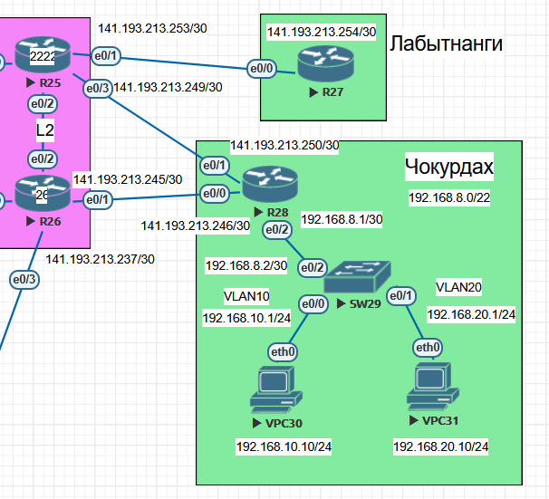

### Настроить PBR.

## Цель:

- Собрать схему;  
      

- Настроить политику маршрутизации в офисе Чокурдах
- Распределить трафик между 2 линками

## Задачи:

- Настроите политику маршрутизации для сетей офиса.
- Распределите трафик между двумя линками с провайдером.
- Настроите отслеживание линка через технологию IP SLA.(только для IPv4)
- Настройте для офиса Лабытнанги маршрут по-умолчанию.


## Таблица адресов для Лабытнанги
| Device  | Interface | IP Address      | Subnet Mask     | Default Gateway |
|---------|-----------|-----------------|-----------------|-----------------|
| R27     | e0/0      | 141.193.213.254 | 255.255.255.252 | 141.193.213.253 |

## Таблица адресов Чокурдан
| Device  | Interface | IP Address      | Subnet Mask     | Default Gateway |
|---------|-----------|-----------------|-----------------|-----------------|
| R28     | lo0       | 192.168.8.28    | 255.255.255.255 |                 |
|         | e0/0      | 141.193.213.246 | 255.255.255.252 | 141.193.213.245 |
|         | e0/1      | 141.193.213.250 | 255.255.255.252 | 141.193.213.249 |
|         | e0/2      | 192.168.8.1     | 255.255.255.252 |                 |
| SW29    | lo0       | 192.168.8.29    | 255.255.255.255 |                 |
|         | e0/0      | 192.168.10.1    | 255.255.255.0   |                 | 
|         | e0/1      | 192.168.20.1    | 255.255.255.0   |                 | 
|         | e0/2      | 192.168.8.2     | 255.255.255.252 | 192.168.8.1     |
| VPC30   | eth0      | 192.168.10.10   | 255.255.255.0   | 192.168.10.1    |
| VPC31   | eht0      | 192.168.20.10   | 255.255.255.0   | 192.168.20.1    |

 
## Таблица VLAN для Чокурдан
| VLAN  |    Name      | Назначенный интерфейс           |
|-------|--------------|---------------------------------|
| 10    | Native       | SW29:  e0/0                     |
| 20    | Native       | SW29:  e0/1                     |
| 999   | ParkingLot   | SW29:  e0/3,e1/0,e1/1,e1/2,e1/3 |


### [Файлы конфигураций устройст и сама работа выполненная в EVE-NG ](https://gl.niknav.ru/otus/network_engineer_professional/-/tree/main/labs/lab05/configs)
В данной работе применялись следующие образы:
 - L3-ADVENTERPRISEK9-M-15.4-2T.bin
 - L2-ADVENTERPRISEK9-M-15.2-20150703.bin

# Приступаем к настрйке устройств:

## Настраиваем базовые параметры

# Лабытнанги

<details>

<summary> Настраиваем интерфейсы для маршрутизатора R27: </summary>

```
interface Ethernet0/0
 no shutdown
 ip address 141.193.213.254 255.255.255.252
!
interface Ethernet0/1
 no shutdown
 no ip address
 shutdown
!
interface Ethernet0/2
 no shutdown
 no ip address
 shutdown
!
interface Ethernet0/3
 no shutdown
 no ip address
 shutdown
!
interface Ethernet1/0
 no shutdown
 no ip address
 shutdown
!
interface Ethernet1/1
 no shutdown
 no ip address
 shutdown
!
interface Ethernet1/2
 no shutdown
 no ip address
 shutdown
!
interface Ethernet1/3
 no shutdown
 no ip address
 shutdown
```
</details>

<details>

<summary> Настраиваем маршрут поумолчанию для маршрутизатора R27: </summary>

```
ip route 0.0.0.0 0.0.0.0 141.193.213.253
```
</details>

# Чокурдан


<details>

<summary> Настраиваем интерфейсы для маршрутизатора R28: </summary>

```
interface Loopback0
 no shutdown
 ip address 192.168.8.28 255.255.255.255
!
interface Ethernet0/0
 no shutdown
 ip address 141.193.213.246 255.255.255.252
!
interface Ethernet0/1
 no shutdown
 ip address 141.193.213.250 255.255.255.252
!
interface Ethernet0/2
 no shutdown
 ip address 192.168.8.1 255.255.255.252
!
interface Ethernet0/3
 no shutdown
 no ip address
 shutdown
!
interface Ethernet1/0
 no shutdown
 no ip address
 shutdown
!
interface Ethernet1/1
 no shutdown
 no ip address
 shutdown
!
interface Ethernet1/2
 no shutdown
 no ip address
 shutdown
!
interface Ethernet1/3
 no shutdown
 no ip address
 shutdown
```
</details>

<details>

<summary> Настраиваем маршрут поумолчанию для локальных подсетей на маршрутизаторе R28: </summary>

```
ip route 192.168.10.0 255.255.255.0 192.168.8.2
ip route 192.168.20.0 255.255.255.0 192.168.8.2

```
</details>

<details>

<summary> Настраиваем интерфейсы для коммутатора S29: </summary>

```
interface Loopback0
 no shutdown
 ip address 192.168.8.29 255.255.255.255
!
interface Ethernet0/0
 no shutdown
 no switchport
 ip address 192.168.10.1 255.255.255.0
 duplex auto
!
interface Ethernet0/1
 no shutdown
 no switchport
 ip address 192.168.20.1 255.255.255.0
 duplex auto
!
interface Ethernet0/2
 no shutdown
 no switchport
 ip address 192.168.8.2 255.255.255.252
 duplex auto
!
interface Ethernet0/3
 no shutdown
```
</details>

</details>

<details>

<summary> Настраиваем маршрут поумолчанию для для коммутатора S29: </summary>

```
ip route 0.0.0.0 0.0.0.0 192.168.8.1

```
</details>


<details>

<summary> Настраиваем VPC30: </summary>

```
set pcname VPCS
ip 192.168.10.10 192.168.10.1 24
```
</details>

<details>

<summary> Настраиваем VPC31: </summary>

```
set pcname VPCS
ip 192.168.20.10 192.168.20.1 24
```
</details>


# Приступаем к настрйке IP SLA и распределению трафика между двумя линками с провайдером на R28:


```

hostname R28
!
track 123 ip sla 1 reachability
 delay down 10 up 5
!
track 124 ip sla 2 reachability
 delay down 10 up 5
!
interface Ethernet0/0
 description $ISP1$
 ip address 141.193.213.246 255.255.255.252
 ip nat outside
 ip virtual-reassembly in
!
interface Ethernet0/1
 description $ISP2$
 ip address 141.193.213.250 255.255.255.252
 ip nat outside
 ip virtual-reassembly in
!
interface Ethernet0/2
 description $LAN$
 ip address 192.168.8.1 255.255.255.252
 ip nat inside
 ip nat enable
 ip virtual-reassembly in
 ip policy route-map tracking
!
ip nat inside source route-map 111 interface Ethernet0/0 overload
ip nat inside source route-map 112 interface Ethernet0/1 overload
ip route 0.0.0.0 0.0.0.0 141.193.213.245 10 track 123
ip route 0.0.0.0 0.0.0.0 141.193.213.249 20 track 124
ip route 192.168.10.0 255.255.255.0 192.168.8.2
ip route 192.168.20.0 255.255.255.0 192.168.8.2
!
ip sla auto discovery
ip sla 1
 icmp-echo 141.193.213.245 source-interface Ethernet0/0
 request-data-size 32
 frequency 5
 history hours-of-statistics-kept 24
ip sla schedule 1 life forever start-time now
ip sla 2
 icmp-echo 141.193.213.249 source-interface Ethernet0/1
 request-data-size 32
 frequency 5
 history hours-of-statistics-kept 24
ip sla schedule 2 life forever start-time now
access-list 115 permit ip 192.168.10.0 0.0.0.255 any
access-list 116 permit ip 192.168.20.0 0.0.0.255 any
!
route-map tracking permit 10
 match ip address 115
 set ip next-hop verify-availability 141.193.213.245 10 track 123
 set ip next-hop verify-availability 141.193.213.249 20 track 124
!
route-map tracking permit 20
 match ip address 116
 set ip next-hop verify-availability 141.193.213.249 10 track 124
 set ip next-hop verify-availability 141.193.213.245 20 track 123
!
route-map 111 permit 10
 match ip address 115 116
 match interface Ethernet0/0
 set ip next-hop 141.193.213.245
!
route-map 112 permit 20
 match ip address 116 115
 match interface Ethernet0/1
 set ip next-hop 141.193.213.249
!
event manager applet TR1DOWN
 event track 123 state down
 action 10 wait 10
 action 15 cli command "enable"
 action 20 cli command "clear ip nat translation *"
event manager applet TR1UP
 event track 123 state up
 action 10 wait 10
 action 15 cli command "enable"
 action 20 cli command "clear ip nat translation *"
event manager applet TR2DOWN
 event track 124 state down
 action 10 wait 10
 action 15 cli command "enable"
 action 20 cli command "clear ip nat translation *"
event manager applet TR2UP
 event track 124 state up
 action 10 wait 10
 action 15 cli command "enable"
 action 20 cli command "clear ip nat translation *"
!

```

# Приступаем к проверке:


<details>

<summary> Проверяем VPC30 </summary>

```
VPCS> ping 141.193.213.245

84 bytes from 141.193.213.245 icmp_seq=1 ttl=253 time=1.427 ms
84 bytes from 141.193.213.245 icmp_seq=2 ttl=253 time=1.283 ms
84 bytes from 141.193.213.245 icmp_seq=3 ttl=253 time=1.243 ms
84 bytes from 141.193.213.245 icmp_seq=4 ttl=253 time=1.218 ms
84 bytes from 141.193.213.245 icmp_seq=5 ttl=253 time=1.385 ms

VPCS> trac 141.193.213.245
trace to 141.193.213.245, 8 hops max, press Ctrl+C to stop
 1   192.168.10.1   0.499 ms  0.378 ms  0.352 ms
 2   192.168.8.1   0.848 ms  0.634 ms  0.651 ms
 3   *141.193.213.245   1.105 ms (ICMP type:3, code:3, Destination port unreachable)  *


```
</details>


<details>

<summary> Проверяем VPC30 </summary>

```
VPCS> ping 141.193.213.249

84 bytes from 141.193.213.249 icmp_seq=1 ttl=253 time=0.973 ms
84 bytes from 141.193.213.249 icmp_seq=2 ttl=253 time=1.197 ms
84 bytes from 141.193.213.249 icmp_seq=3 ttl=253 time=1.196 ms
84 bytes from 141.193.213.249 icmp_seq=4 ttl=253 time=1.257 ms
84 bytes from 141.193.213.249 icmp_seq=5 ttl=253 time=1.274 ms

VPCS> trace 141.193.213.249
trace to 141.193.213.249, 8 hops max, press Ctrl+C to stop
 1   192.168.20.1   0.360 ms  0.381 ms  0.289 ms
 2   192.168.8.1   0.766 ms  0.495 ms  0.599 ms
 3   *141.193.213.249   0.850 ms (ICMP type:3, code:3, Destination port unreachable)  *

```
</details>
