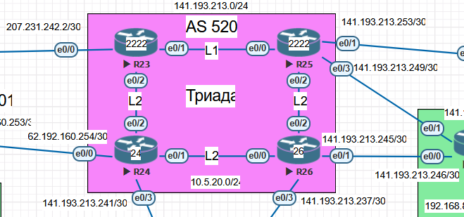

### Настроить IS-IS.

## Цель:

- Собрать схему;  
      

- Настроить IS-IS офисе Триада 

## Задачи:

- Настроите IS-IS в ISP Триада.
- R23 и R25 находятся в зоне 2222.
- R24 находится в зоне 24.
- R26 находится в зоне 26.


## Таблица адресов для AS 520 (Триада)
| Device  | Interface | IP Address      | Subnet Mask     | Default Gateway |
|---------|-----------|-----------------|-----------------|-----------------|
| R23     | lo0       | 10.5.20.23      | 255.255.255.255 |                 |
|         | e0/0      | 207.231.242.2   | 255.255.255.252 |                 |
|         | e0/1      | 10.5.20.1       | 255.255.255.252 |                 |
|         | e0/2      | 10.5.20.5       | 255.255.255.252 |                 |
| R24     | lo0       | 10.5.20.24      | 255.255.255.255 |                 |
|         | e0/0      | 62.192.160.254  | 255.255.255.252 |                 |
|         | e0/1      | 10.5.20.13      | 255.255.255.252 |                 |
|         | e0/2      | 10.5.20.6       | 255.255.255.252 |                 |
|         | e0/3      | 141.193.213.241 | 255.255.255.252 |                 |
| R25     | lo0       | 10.5.20.25      | 255.255.255.255 |                 |
|         | e0/0      | 10.5.20.2       | 255.255.255.252 |                 | 
|         | e0/1      | 141.193.213.253 | 255.255.255.252 |                 |
|         | e0/2      | 10.5.20.9       | 255.255.255.252 |                 |
|         | e0/3      | 141.193.213.249 | 255.255.255.252 |                 |
| R26     | lo0       | 10.5.20.26      | 255.255.255.255 |                 |
|         | e0/0      | 10.5.20.14      | 255.255.255.252 |                 |
|         | e0/1      | 141.193.213.245 | 255.255.255.252 |                 |
|         | e0/2      | 10.5.20.10      | 255.255.255.252 |                 |
|         | e0/3      | 141.193.213.237 | 255.255.255.252 |                 |

### [Файлы конфигураций устройст и сама работа выполненная в EVE-NG ](https://gl.niknav.ru/otus/network_engineer_professional/-/tree/main/labs/lab07/configs)
В данной работе применялись следующие образы:
 - L3-ADVENTERPRISEK9-M-15.4-2T.bin
 - L2-ADVENTERPRISEK9-M-15.2-20150703.bin

# Приступаем к настрйке устройств:

## Настраиваем базовые параметры

# AS 520 (Триада)

<details>

<summary> Настраиваем интерфейсы для маршрутизатора R23: </summary>

```
nterface Loopback0
 no shutdown
 ip address 10.5.20.23 255.255.255.255
!
interface Ethernet0/0
 no shutdown
 ip address 207.231.242.2 255.255.255.252
!
interface Ethernet0/1
 no shutdown
 ip address 10.5.20.1 255.255.255.252
!
interface Ethernet0/2
 no shutdown
 ip address 10.5.20.5 255.255.255.252
!
interface Ethernet0/3
 no shutdown
 no ip address
 shutdown
!
interface Ethernet1/0
 no shutdown
 no ip address
 shutdown
!
interface Ethernet1/1
 no shutdown
 no ip address
 shutdown
!
interface Ethernet1/2
 no shutdown
 no ip address
 shutdown
!
interface Ethernet1/3
 no shutdown
 no ip address
 shutdown
```
</details>

<details>

<summary> Настраиваем интерфейсы для маршрутизатора R24: </summary>

```
interface Loopback0
 no shutdown
 ip address 10.5.20.24 255.255.255.255
!
interface Ethernet0/0
 no shutdown
 ip address 62.192.160.254 255.255.255.252
!
interface Ethernet0/1
 no shutdown
 ip address 10.5.20.13 255.255.255.252
!
interface Ethernet0/2
 no shutdown
 ip address 10.5.20.6 255.255.255.252
!
interface Ethernet0/3
 no shutdown
 ip address 141.193.213.241 255.255.255.252
!
interface Ethernet1/0
 no shutdown
 no ip address
 shutdown
!
interface Ethernet1/1
 no shutdown
 no ip address
 shutdown
!
interface Ethernet1/2
 no shutdown
 no ip address
 shutdown
!
interface Ethernet1/3
 no shutdown
 no ip address
 shutdown
```
</details>


<details>

<summary> Настраиваем интерфейсы для маршрутизатора R25: </summary>

```
interface Loopback0
 no shutdown
 ip address 10.5.20.25 255.255.255.255
!
interface Ethernet0/0
 no shutdown
 ip address 10.5.20.2 255.255.255.252
!
interface Ethernet0/1
 no shutdown
 ip address 141.193.213.253 255.255.255.252
!
interface Ethernet0/2
 no shutdown
 ip address 10.5.20.9 255.255.255.252
!
interface Ethernet0/3
 no shutdown
 ip address 141.193.213.249 255.255.255.252
!
interface Ethernet1/0
 no shutdown
 no ip address
 shutdown
!
interface Ethernet1/1
 no shutdown
 no ip address
 shutdown
!
interface Ethernet1/2
 no shutdown
 no ip address
 shutdown
!
interface Ethernet1/3
 no shutdown
 no ip address
 shutdown
```
</details>


<details>

<summary> Настраиваем интерфейсы для маршрутизатора R26: </summary>

```
interface Loopback0
 no shutdown
 ip address 10.5.20.26 255.255.255.255
!
interface Ethernet0/0
 no shutdown
 ip address 10.5.20.14 255.255.255.252
!
interface Ethernet0/1
 no shutdown
 ip address 141.193.213.245 255.255.255.252
!
interface Ethernet0/2
 no shutdown
 ip address 10.5.20.10 255.255.255.252
!
interface Ethernet0/3
 no shutdown
 ip address 141.193.213.237 255.255.255.252
!
interface Ethernet1/0
 no shutdown
 no ip address
 shutdown
!
interface Ethernet1/1
 no shutdown
 no ip address
 shutdown
!
interface Ethernet1/2
 no shutdown
 no ip address
 shutdown
!
interface Ethernet1/3
 no shutdown
 no ip address
 shutdown
```
</details>

# Приступаем к настрйке IS-IS:

<details>

<summary> Настраиваем маршрутизатор R23 </summary>

```
!
interface Loopback0
 no shutdown
 ip address 10.5.20.23 255.255.255.255
 ip router isis Underlay
!
!
interface Ethernet0/1
 no shutdown
 ip address 10.5.20.1 255.255.255.252
 ip router isis Underlay
!
interface Ethernet0/2
 no shutdown
 ip address 10.5.20.5 255.255.255.252
 ip router isis Underlay
!
router isis Underlay
 net 49.2222.0010.0005.2023.00
 metric-style wide
 log-adjacency-changes
 passive-interface default
 no passive-interface Ethernet0/1
 no passive-interface Ethernet0/2
 no passive-interface Loopback0
!

```
</details>


<details>

<summary> Настраиваем маршрутизатор R24 </summary>

```
interface Loopback0
 no shutdown
 ip address 10.5.20.24 255.255.255.255
 ip router isis Underlay
!
interface Ethernet0/1
 no shutdown
 ip address 10.5.20.13 255.255.255.252
 ip router isis Underlay
!
interface Ethernet0/2
 no shutdown
 ip address 10.5.20.6 255.255.255.252
 ip router isis Underlay
!
router isis Underlay
 net 49.0024.0010.0005.2024.00
 is-type level-2-only
 metric-style wide
 log-adjacency-changes
 passive-interface default
 no passive-interface Ethernet0/1
 no passive-interface Ethernet0/2
 no passive-interface Loopback0
!

```
</details>


<details>

<summary> Настраиваем маршрутизатор R25 </summary>

```
!
interface Loopback0
 no shutdown
 ip address 10.5.20.25 255.255.255.255
 ip router isis Underlay
!
interface Ethernet0/0
 no shutdown
 ip address 10.5.20.2 255.255.255.252
 ip router isis Underlay
!
interface Ethernet0/2
 no shutdown
 ip address 10.5.20.9 255.255.255.252
 ip router isis Underlay
!
router isis Underlay
 net 49.2222.0010.0005.2025.00
 metric-style wide
 log-adjacency-changes
 passive-interface default
 no passive-interface Ethernet0/0
 no passive-interface Ethernet0/2
 no passive-interface Loopback0
!

```
</details>


<details>

<summary> Настраиваем маршрутизатор R26 </summary>

```
!
interface Loopback0
 no shutdown
 ip address 10.5.20.26 255.255.255.255
 ip router isis Underlay
!
interface Ethernet0/0
 no shutdown
 ip address 10.5.20.14 255.255.255.252
 ip router isis Underlay
!
interface Ethernet0/2
 no shutdown
 ip address 10.5.20.10 255.255.255.252
 ip router isis Underlay
!
router isis Underlay
 net 49.0026.0010.0005.2026.00
 is-type level-2-only
 metric-style wide
 log-adjacency-changes
 passive-interface default
 no passive-interface Ethernet0/0
 no passive-interface Ethernet0/2
 no passive-interface Loopback0
!

```
</details>


## Приступаем к проверке устройств:

<details>

<summary> Маршрутизатор R23 </summary>

```
R23#show isis hostname
Level  System ID      Dynamic Hostname  (Underlay)
 2     0010.0005.2025 R25
 2     0010.0005.2024 R24
 2     0010.0005.2026 R26
     * 0010.0005.2023 R23
R23#
R23#show isis database

Tag Underlay:
IS-IS Level-1 Link State Database:
LSPID                 LSP Seq Num  LSP Checksum  LSP Holdtime      ATT/P/OL
R23.00-00           * 0x0000000A   0xC7E4        1077              1/0/0
R25.00-00             0x00000005   0xDB0D        980               1/0/0
R25.01-00             0x00000002   0x50E7        834               0/0/0
IS-IS Level-2 Link State Database:
LSPID                 LSP Seq Num  LSP Checksum  LSP Holdtime      ATT/P/OL
R23.00-00           * 0x0000000B   0x0CB4        970               0/0/0
R24.00-00             0x00000004   0xAE7B        438               0/0/0
R24.02-00             0x00000002   0x6061        1004              0/0/0
R25.00-00             0x00000005   0x8246        438               0/0/0
R25.01-00             0x00000002   0x6858        723               0/0/0
R26.00-00             0x00000004   0x069A        1131              0/0/0
R26.01-00             0x00000002   0x7D40        1164              0/0/0
R26.02-00             0x00000001   0x8C30        437               0/0/0
R23#
R23#show ip route isis
Codes: L - local, C - connected, S - static, R - RIP, M - mobile, B - BGP
       D - EIGRP, EX - EIGRP external, O - OSPF, IA - OSPF inter area
       N1 - OSPF NSSA external type 1, N2 - OSPF NSSA external type 2
       E1 - OSPF external type 1, E2 - OSPF external type 2
       i - IS-IS, su - IS-IS summary, L1 - IS-IS level-1, L2 - IS-IS level-2
       ia - IS-IS inter area, * - candidate default, U - per-user static route
       o - ODR, P - periodic downloaded static route, H - NHRP, l - LISP
       + - replicated route, % - next hop override

Gateway of last resort is not set

      10.0.0.0/8 is variably subnetted, 10 subnets, 2 masks
i L1     10.5.20.8/30 [115/20] via 10.5.20.2, 00:20:22, Ethernet0/1
i L2     10.5.20.12/30 [115/20] via 10.5.20.6, 00:15:22, Ethernet0/2
i L2     10.5.20.24/32 [115/20] via 10.5.20.6, 00:15:22, Ethernet0/2
i L1     10.5.20.25/32 [115/20] via 10.5.20.2, 00:20:22, Ethernet0/1
i L2     10.5.20.26/32 [115/30] via 10.5.20.6, 00:12:39, Ethernet0/2
                       [115/30] via 10.5.20.2, 00:12:39, Ethernet0/1
      62.0.0.0/30 is subnetted, 1 subnets
i L2     62.192.160.252 [115/10] via 10.5.20.6, 00:15:22, Ethernet0/2
      141.193.0.0/30 is subnetted, 5 subnets
i L2     141.193.213.236 [115/20] via 10.5.20.6, 00:12:39, Ethernet0/2
                         [115/20] via 10.5.20.2, 00:12:39, Ethernet0/1
i L2     141.193.213.240 [115/10] via 10.5.20.6, 00:15:22, Ethernet0/2
i L2     141.193.213.244 [115/20] via 10.5.20.6, 00:12:39, Ethernet0/2
                         [115/20] via 10.5.20.2, 00:12:39, Ethernet0/1
i L1     141.193.213.248 [115/10] via 10.5.20.2, 00:20:22, Ethernet0/1
i L1     141.193.213.252 [115/10] via 10.5.20.2, 00:20:22, Ethernet0/1
R23#


```
</details>


<details>

<summary> Маршрутизатор R24 </summary>

```
R24#show isis hostname
Level  System ID      Dynamic Hostname  (Underlay)
 2     0010.0005.2025 R25
     * 0010.0005.2024 R24
 2     0010.0005.2026 R26
 2     0010.0005.2023 R23
R24#
R24#show isis database

Tag Underlay:
IS-IS Level-2 Link State Database:
LSPID                 LSP Seq Num  LSP Checksum  LSP Holdtime      ATT/P/OL
R23.00-00             0x0000000B   0x0CB4        794               0/0/0
R24.00-00           * 0x00000005   0xAC7C        1115              0/0/0
R24.02-00           * 0x00000002   0x6061        833               0/0/0
R25.00-00             0x00000006   0x8047        1125              0/0/0
R25.01-00             0x00000002   0x6858        548               0/0/0
R26.00-00             0x00000004   0x069A        959               0/0/0
R26.01-00             0x00000002   0x7D40        992               0/0/0
R26.02-00             0x00000002   0x8A31        1043              0/0/0
R24#
R24#show ip route isis
Codes: L - local, C - connected, S - static, R - RIP, M - mobile, B - BGP
       D - EIGRP, EX - EIGRP external, O - OSPF, IA - OSPF inter area
       N1 - OSPF NSSA external type 1, N2 - OSPF NSSA external type 2
       E1 - OSPF external type 1, E2 - OSPF external type 2
       i - IS-IS, su - IS-IS summary, L1 - IS-IS level-1, L2 - IS-IS level-2
       ia - IS-IS inter area, * - candidate default, U - per-user static route
       o - ODR, P - periodic downloaded static route, H - NHRP, l - LISP
       + - replicated route, % - next hop override

Gateway of last resort is not set

      10.0.0.0/8 is variably subnetted, 10 subnets, 2 masks
i L2     10.5.20.0/30 [115/20] via 10.5.20.5, 00:18:17, Ethernet0/2
i L2     10.5.20.8/30 [115/20] via 10.5.20.14, 00:15:32, Ethernet0/1
i L2     10.5.20.23/32 [115/20] via 10.5.20.5, 00:18:17, Ethernet0/2
i L2     10.5.20.25/32 [115/30] via 10.5.20.14, 00:15:32, Ethernet0/1
                       [115/30] via 10.5.20.5, 00:15:32, Ethernet0/2
i L2     10.5.20.26/32 [115/20] via 10.5.20.14, 00:15:32, Ethernet0/1
      141.193.0.0/16 is variably subnetted, 6 subnets, 2 masks
i L2     141.193.213.236/30 [115/10] via 10.5.20.14, 00:15:32, Ethernet0/1
i L2     141.193.213.244/30 [115/10] via 10.5.20.14, 00:15:32, Ethernet0/1
i L2     141.193.213.248/30 [115/20] via 10.5.20.14, 00:15:32, Ethernet0/1
                            [115/20] via 10.5.20.5, 00:15:32, Ethernet0/2
i L2     141.193.213.252/30 [115/20] via 10.5.20.14, 00:15:32, Ethernet0/1
                            [115/20] via 10.5.20.5, 00:15:32, Ethernet0/2
      207.231.242.0/30 is subnetted, 1 subnets
i L2     207.231.242.0 [115/10] via 10.5.20.5, 00:18:17, Ethernet0/2
R24#


```
</details>


<details>

<summary> Маршрутизатор R25 </summary>

```
R25#show isis hostname
Level  System ID      Dynamic Hostname  (Underlay)
     * 0010.0005.2025 R25
 2     0010.0005.2024 R24
 2     0010.0005.2026 R26
 2     0010.0005.2023 R23
R25#
R25#show isis database

Tag Underlay:
IS-IS Level-1 Link State Database:
LSPID                 LSP Seq Num  LSP Checksum  LSP Holdtime      ATT/P/OL
R23.00-00             0x0000000A   0xC7E4        810               1/0/0
R25.00-00           * 0x00000005   0xDB0D        717               1/0/0
R25.01-00           * 0x00000002   0x50E7        571               0/0/0
IS-IS Level-2 Link State Database:
LSPID                 LSP Seq Num  LSP Checksum  LSP Holdtime      ATT/P/OL
R23.00-00             0x0000000B   0x0CB4        703               0/0/0
R24.00-00             0x00000005   0xAC7C        1020              0/0/0
R24.02-00             0x00000002   0x6061        738               0/0/0
R25.00-00           * 0x00000006   0x8047        1038              0/0/0
R25.01-00           * 0x00000003   0x6659        1149              0/0/0
R26.00-00             0x00000004   0x069A        868               0/0/0
R26.01-00             0x00000002   0x7D40        901               0/0/0
R26.02-00             0x00000002   0x8A31        952               0/0/0
R25#
R25#show ip route isis
Codes: L - local, C - connected, S - static, R - RIP, M - mobile, B - BGP
       D - EIGRP, EX - EIGRP external, O - OSPF, IA - OSPF inter area
       N1 - OSPF NSSA external type 1, N2 - OSPF NSSA external type 2
       E1 - OSPF external type 1, E2 - OSPF external type 2
       i - IS-IS, su - IS-IS summary, L1 - IS-IS level-1, L2 - IS-IS level-2
       ia - IS-IS inter area, * - candidate default, U - per-user static route
       o - ODR, P - periodic downloaded static route, H - NHRP, l - LISP
       + - replicated route, % - next hop override

Gateway of last resort is not set

      10.0.0.0/8 is variably subnetted, 10 subnets, 2 masks
i L1     10.5.20.4/30 [115/20] via 10.5.20.1, 00:24:46, Ethernet0/0
i L2     10.5.20.12/30 [115/20] via 10.5.20.10, 00:17:02, Ethernet0/2
i L1     10.5.20.23/32 [115/20] via 10.5.20.1, 00:24:46, Ethernet0/0
i L2     10.5.20.24/32 [115/30] via 10.5.20.10, 00:17:02, Ethernet0/2
                       [115/30] via 10.5.20.1, 00:17:02, Ethernet0/0
i L2     10.5.20.26/32 [115/20] via 10.5.20.10, 00:17:02, Ethernet0/2
      62.0.0.0/30 is subnetted, 1 subnets
i L2     62.192.160.252 [115/20] via 10.5.20.10, 00:17:02, Ethernet0/2
                        [115/20] via 10.5.20.1, 00:17:02, Ethernet0/0
      141.193.0.0/16 is variably subnetted, 7 subnets, 2 masks
i L2     141.193.213.236/30 [115/10] via 10.5.20.10, 00:17:02, Ethernet0/2
i L2     141.193.213.240/30 [115/20] via 10.5.20.10, 00:17:02, Ethernet0/2
                            [115/20] via 10.5.20.1, 00:17:02, Ethernet0/0
i L2     141.193.213.244/30 [115/10] via 10.5.20.10, 00:17:02, Ethernet0/2
      207.231.242.0/30 is subnetted, 1 subnets
i L1     207.231.242.0 [115/10] via 10.5.20.1, 00:24:46, Ethernet0/0


```
</details>


<details>

<summary> Маршрутизатор R26 </summary>

```
R26#show  isis hostname
Level  System ID      Dynamic Hostname  (Underlay)
 2     0010.0005.2025 R25
 2     0010.0005.2024 R24
     * 0010.0005.2026 R26
 2     0010.0005.2023 R23
R26#
R26#show  isis database

Tag Underlay:
IS-IS Level-2 Link State Database:
LSPID                 LSP Seq Num  LSP Checksum  LSP Holdtime      ATT/P/OL
R23.00-00             0x0000000B   0x0CB4        612               0/0/0
R24.00-00             0x00000005   0xAC7C        933               0/0/0
R24.02-00             0x00000002   0x6061        650               0/0/0
R25.00-00             0x00000006   0x8047        947               0/0/0
R25.01-00             0x00000003   0x6659        1058              0/0/0
R26.00-00           * 0x00000004   0x069A        781               0/0/0
R26.01-00           * 0x00000002   0x7D40        814               0/0/0
R26.02-00           * 0x00000002   0x8A31        864               0/0/0
R26#
R26#show ip route isis
Codes: L - local, C - connected, S - static, R - RIP, M - mobile, B - BGP
       D - EIGRP, EX - EIGRP external, O - OSPF, IA - OSPF inter area
       N1 - OSPF NSSA external type 1, N2 - OSPF NSSA external type 2
       E1 - OSPF external type 1, E2 - OSPF external type 2
       i - IS-IS, su - IS-IS summary, L1 - IS-IS level-1, L2 - IS-IS level-2
       ia - IS-IS inter area, * - candidate default, U - per-user static route
       o - ODR, P - periodic downloaded static route, H - NHRP, l - LISP
       + - replicated route, % - next hop override

Gateway of last resort is not set

      10.0.0.0/8 is variably subnetted, 10 subnets, 2 masks
i L2     10.5.20.0/30 [115/20] via 10.5.20.9, 00:18:34, Ethernet0/2
i L2     10.5.20.4/30 [115/20] via 10.5.20.13, 00:18:34, Ethernet0/0
i L2     10.5.20.23/32 [115/30] via 10.5.20.13, 00:18:24, Ethernet0/0
                       [115/30] via 10.5.20.9, 00:18:24, Ethernet0/2
i L2     10.5.20.24/32 [115/20] via 10.5.20.13, 00:18:34, Ethernet0/0
i L2     10.5.20.25/32 [115/20] via 10.5.20.9, 00:18:34, Ethernet0/2
      62.0.0.0/30 is subnetted, 1 subnets
i L2     62.192.160.252 [115/10] via 10.5.20.13, 00:18:34, Ethernet0/0
      141.193.0.0/16 is variably subnetted, 7 subnets, 2 masks
i L2     141.193.213.240/30 [115/10] via 10.5.20.13, 00:18:34, Ethernet0/0
i L2     141.193.213.248/30 [115/10] via 10.5.20.9, 00:18:34, Ethernet0/2
i L2     141.193.213.252/30 [115/10] via 10.5.20.9, 00:18:34, Ethernet0/2
      207.231.242.0/30 is subnetted, 1 subnets
i L2     207.231.242.0 [115/20] via 10.5.20.13, 00:18:24, Ethernet0/0
                       [115/20] via 10.5.20.9, 00:18:24, Ethernet0/2


```
</details>


