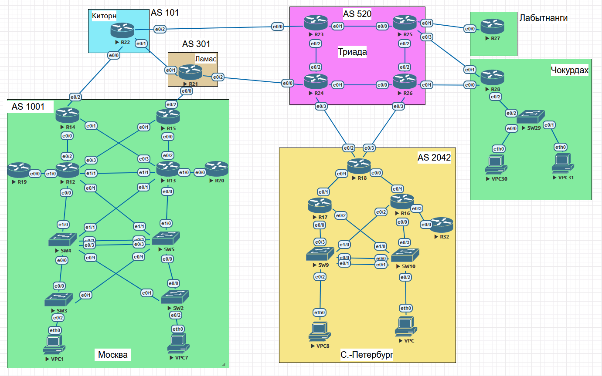

### Настроить EIGRP.

## Цель:

- Собрать схему;  
      

- Настроить EIGRP в С.-Петербург;
- Использовать named EIGRP 

## Задачи:

- В офисе С.-Петербург настроить EIGRP.
- R32 получает только маршрут по умолчанию.
- R16-17 анонсируют только суммарные префиксы.
- Использовать EIGRP named-mode для настройки сети.

