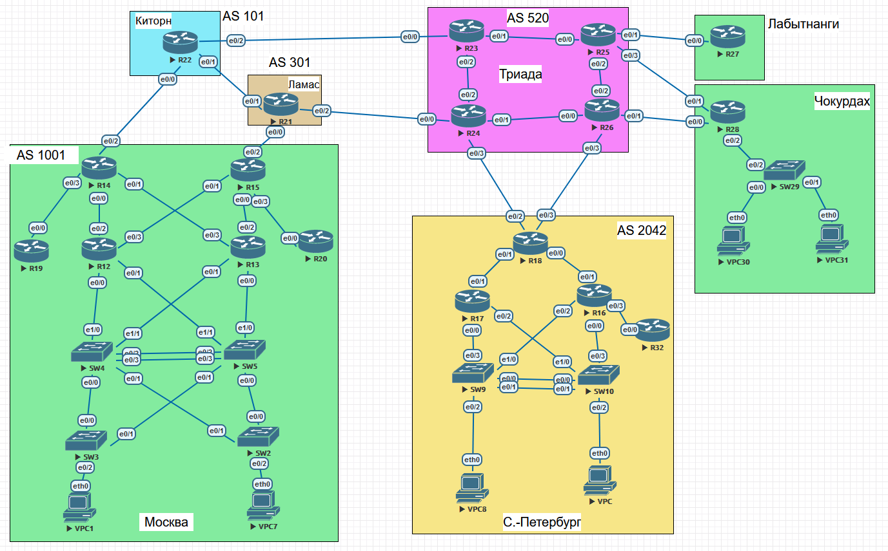

### Настроить iBGP.

## Цель:

- Собрать схему;  
      

- Настроить iBGP в офисе Москва
- Настроить iBGP в сети провайдера Триада
- Организовать полную IP связанность всех сетей 

## Задачи:

- Настроите iBGP в офисом Москва между маршрутизаторами R14 и R15.
- Настроите iBGP в провайдере Триада, с использованием RR.
- Настройте офиса Москва так, чтобы приоритетным провайдером стал Ламас.
- Настройте офиса С.-Петербург так, чтобы трафик до любого офиса распределялся по двум линкам одновременно.
- Все сети в лабораторной работе должны иметь IP связность. 

