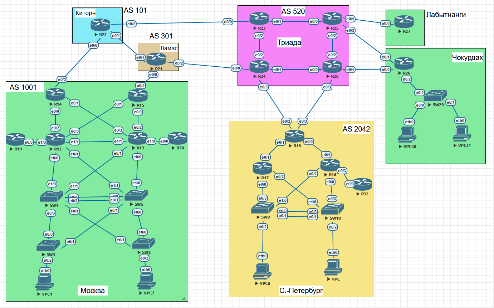

### Настроить BGP. Фильтрацию.

## Цель:

- Собрать схему;  
      

- Настроить фильтрацию для офисе Москва
- Настроить фильтрацию для офисе С.-Петербург

## Задачи:

- Настроить фильтрацию в офисе Москва так, чтобы не появилось транзитного трафика(As-path).
- Настроить фильтрацию в офисе С.-Петербург так, чтобы не появилось транзитного трафика(Prefix-list).
- Настроить провайдера Киторн так, чтобы в офис Москва отдавался только маршрут по умолчанию.
- Настроить провайдера Ламас так, чтобы в офис Москва отдавался только маршрут по умолчанию и префикс офиса С.-Петербург.
- Все сети в лабораторной работе должны иметь IP связность.

